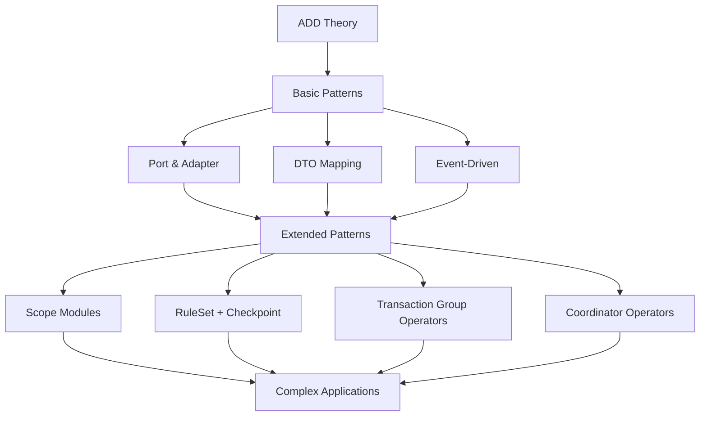

# Abstract Driven Development Patterns

This directory contains comprehensive documentation of patterns used in Abstract Driven Development (ADD), organized into basic and extended categories.

## Pattern Categories

### 📘 [Basic Patterns](./basic/)
Fundamental patterns that form the core of ADD architecture. These patterns are essential for implementing the 5-layer ADD structure and should be understood before moving to extended patterns.

- **[Port & Adapter Pattern](./basic/Port_Adapter_Pattern.md)** - Isolate business logic from external systems
- **[DTO ↔ Entity Mapping](./basic/DTO_Entity_Mapping.md)** - Transform data between external contracts and internal domain models
- **[Event-Driven Communication](./basic/Event_Driven_Communication.md)** - Decouple components through asynchronous messaging

### 🚀 [Extended Patterns](./extended/)
Advanced patterns for complex enterprise scenarios. These patterns build upon the basic patterns and address sophisticated business requirements.

- **[Scope Modules](./extended/Scope_Modules.md)** - Organize complex domains into manageable sub-systems
- **[RuleSet + Checkpoint](./extended/RuleSet_Checkpoint.md)** - Implement flexible, composable business rule validation
- **[Transaction Group Operators (TGO)](./extended/Transaction_Group_Operators.md)** - Coordinate multiple operations as atomic units
- **[Coordinator Operators](./extended/Coordinator_Operators.md)** - Orchestrate complex business workflows

## ADD Architecture Quick Reference

All patterns support the 5-layer ADD architecture:

```
┌─────────────────────────────────────┐
│            Boundary                 │  ← DTOs, Controllers, External APIs
├─────────────────────────────────────┤
│        Core Abstractions            │  ← Entities, Value Objects, Ports
├─────────────────────────────────────┤
│           Operators                 │  ← Business Logic Orchestration
├─────────────────────────────────────┤
│        Implementations              │  ← Adapters, Repositories, Services
├─────────────────────────────────────┤
│          Bootstrap                  │  ← Dependency Injection, Configuration
└─────────────────────────────────────┘
```

## Pattern Selection Guide

### When to Use Basic Patterns

| Pattern | Use When | Key Benefits |
|---------|----------|--------------|
| **Port & Adapter** | Integrating with external systems | Technology independence, testability |
| **DTO ↔ Entity Mapping** | Building APIs or external interfaces | API stability, rich domain models |
| **Event-Driven Communication** | Need loose coupling between components | Scalability, maintainability |

### When to Use Extended Patterns

| Pattern | Use When | Key Benefits |
|---------|----------|--------------|
| **Scope Modules** | Large, complex domains with multiple teams | Clear boundaries, parallel development |
| **RuleSet + Checkpoint** | Complex, changing business rules | Flexibility, composability, testability |
| **Transaction Group Operators** | Multi-step operations requiring atomicity | Data consistency, error recovery |
| **Coordinator Operators** | Complex business workflows | Process flexibility, observability |

## Implementation Examples

Each pattern includes:
- ✅ **Problem & Solution** - Clear explanation of when and why to use
- ✅ **Structure Diagrams** - Visual representation using Mermaid
- ✅ **Complete Code Examples** - TypeScript implementations
- ✅ **Key Principles** - Important concepts and guidelines
- ✅ **Benefits & Trade-offs** - Advantages and considerations
- ✅ **Anti-Patterns** - Common mistakes to avoid
- ✅ **Best Practices** - Proven approaches and recommendations

## Quick Start

1. **Start with Basic Patterns**: Master Port & Adapter, DTO Mapping, and Event-Driven Communication
2. **Understand ADD Layers**: Ensure you understand the 5-layer architecture
3. **Choose Extended Patterns**: Select based on your specific complexity needs
4. **See Examples**: Check [examples folder](../examples/) for complete implementations

## Learning Path



## Pattern Relationships

Understanding how patterns work together:

### Basic Pattern Synergy
- **Port & Adapter** provides the foundation for **Event-Driven Communication**
- **DTO ↔ Entity Mapping** works within **Port & Adapter** at the boundary layer
- **Event-Driven Communication** enables loose coupling between all patterns

### Extended Pattern Dependencies
- **Scope Modules** use all basic patterns within each scope
- **RuleSet + Checkpoint** leverages **Port & Adapter** for rule storage
- **Transaction Group Operators** coordinate multiple operators using **Event-Driven Communication**
- **Coordinator Operators** orchestrate workflows that may span **Scope Modules**

## Code Quality Standards

All pattern examples follow these standards:
- **TypeScript** with strict type checking
- **Domain-Driven Design** principles
- **SOLID** principles compliance
- **Dependency Inversion** throughout
- **Test-Driven Development** approach
- **Clean Architecture** alignment

## Contributing

When adding new patterns:
1. Follow the established template structure
2. Include complete, working code examples
3. Provide Mermaid diagrams for visual clarity
4. Document anti-patterns and best practices
5. Show integration with existing patterns

## Pattern Template

```markdown
# Pattern Name

## Intent
[Clear statement of pattern purpose]

## Problem
[Specific problems this pattern solves]

## Solution
[High-level approach]

## Structure
[Mermaid diagram showing relationships]

## Implementation
[Complete code examples]

## Key Principles
[Important concepts]

## Benefits
[Advantages of using this pattern]

## Anti-Patterns
[Common mistakes to avoid]

## Best Practices
[Proven recommendations]
```

## Additional Resources

- 📚 [ADD Theory V3](../theories/v3/ADD%20Theory%20V3.en.md) - Theoretical foundation
- 🛠️ [Examples](../examples/) - Complete working implementations
- 📖 [Principles](../principles/) - Core ADD principles
- 🎯 [Presentations](../presentations/) - Training materials

## Pattern Support Matrix

| Pattern | ADD Layer | Complexity | Team Size | When to Use |
|---------|-----------|------------|-----------|-------------|
| Port & Adapter | All Layers | Basic | Any | Always - Foundation pattern |
| DTO Mapping | Boundary/Operators | Basic | Any | APIs and external interfaces |
| Event-Driven | All Layers | Basic | Any | Loose coupling needed |
| Scope Modules | Architecture | High | Large | Complex domains, multiple teams |
| RuleSet + Checkpoint | Operators | Medium | Medium | Dynamic business rules |
| TGO | Operators | High | Medium | Multi-step transactions |
| Coordinator | Operators | High | Large | Complex workflows |

---

*These patterns represent proven approaches for implementing Abstract Driven Development in enterprise applications. Start with basic patterns and gradually adopt extended patterns as your complexity requirements grow.*