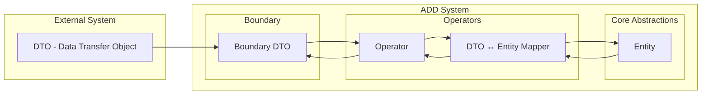

# DTO ↔ Entity Mapping Pattern

## Intent
Transform data between external system contracts (DTOs) and internal domain models (Entities) while maintaining clean boundaries and business logic integrity.

## Problem
- External APIs require stable, simple data formats
- Internal domain models need rich behavior and validation
- Direct exposure of entities couples external contracts to internal structure
- Changes to business logic shouldn't break API contracts

## Solution
Create explicit mapping between DTOs and Entities in the Operator layer, maintaining two distinct representations optimized for their respective purposes.

## Structure



## Implementation

### 1. Boundary DTO (External Contract)
```typescript
// boundary/dto/create-user.dto.ts
export interface CreateUserDto {
  email: string;           // String for API simplicity
  fullName: string;        // Flat structure
  birthDate: string;       // ISO string for serialization
  preferences?: {          // Optional nested object
    newsletter: boolean;
    theme: 'light' | 'dark';
  };
}

export interface UserResponseDto {
  id: string;              // Always string for external systems
  email: string;
  fullName: string;
  birthDate: string;
  isActive: boolean;
  createdAt: string;       // ISO timestamp
  lastLoginAt?: string;    // Optional for external consumers
}
```

### 2. Core Entity (Internal Domain Model)
```typescript
// core-abstractions/entities/user.entity.ts
export class User {
  constructor(
    public readonly id: UserId,           // Rich value object
    public readonly email: Email,        // Validated value object
    public readonly fullName: FullName,  // Structured value object
    public readonly birthDate: Date,     // Proper Date object
    public readonly preferences: UserPreferences, // Rich domain object
    public readonly isActive: boolean,
    public readonly createdAt: Date,
    public readonly lastLoginAt: Date | null
  ) {
    // Domain validation
    this.validateAge();
    this.validateBusinessRules();
  }

  // Factory method for creation
  static create(dto: CreateUserDto): User {
    return new User(
      UserId.generate(),
      new Email(dto.email),
      FullName.fromString(dto.fullName),
      new Date(dto.birthDate),
      UserPreferences.fromDto(dto.preferences),
      true, // New users are active
      new Date(),
      null // Never logged in
    );
  }

  // Business methods
  updateEmail(newEmail: Email): User {
    return new User(
      this.id,
      newEmail,
      this.fullName,
      this.birthDate,
      this.preferences,
      this.isActive,
      this.createdAt,
      this.lastLoginAt
    );
  }

  recordLogin(): User {
    return new User(
      this.id,
      this.email,
      this.fullName,
      this.birthDate,
      this.preferences,
      this.isActive,
      this.createdAt,
      new Date() // Update last login
    );
  }

  private validateAge(): void {
    const age = Date.now() - this.birthDate.getTime();
    const ageInYears = age / (365.25 * 24 * 60 * 60 * 1000);
    if (ageInYears < 13) {
      throw new Error('Users must be at least 13 years old');
    }
  }

  private validateBusinessRules(): void {
    // Additional business validation
  }
}
```

### 3. Operator Mapping (Transformation Logic)
```typescript
// operators/user.operator.ts
export class UserOperator {
  constructor(
    private userRepository: IUserRepository,
    private eventBus: IEventBus
  ) {}

  async createUser(dto: CreateUserDto): Promise<UserResponseDto> {
    // Business validation
    await this.validateUniqueEmail(dto.email);

    // DTO → Entity transformation
    const user = User.create(dto);

    // Business operations
    await this.userRepository.save(user);
    await this.eventBus.emit(new UserCreatedEvent(user.id.value));

    // Entity → Response DTO transformation
    return this.mapToResponseDto(user);
  }

  async getUserById(id: string): Promise<UserResponseDto | null> {
    const userId = UserId.fromString(id);
    const user = await this.userRepository.findById(userId);

    if (!user) {
      return null;
    }

    // Entity → Response DTO transformation
    return this.mapToResponseDto(user);
  }

  async updateUser(id: string, dto: UpdateUserDto): Promise<UserResponseDto> {
    const userId = UserId.fromString(id);
    const existingUser = await this.userRepository.findById(userId);

    if (!existingUser) {
      throw new Error('User not found');
    }

    // Partial DTO → Entity transformation
    const updatedUser = this.applyUpdates(existingUser, dto);

    await this.userRepository.save(updatedUser);

    // Entity → Response DTO transformation
    return this.mapToResponseDto(updatedUser);
  }

  // Private mapping methods
  private mapToResponseDto(user: User): UserResponseDto {
    return {
      id: user.id.value,
      email: user.email.value,
      fullName: user.fullName.value,
      birthDate: user.birthDate.toISOString(),
      isActive: user.isActive,
      createdAt: user.createdAt.toISOString(),
      lastLoginAt: user.lastLoginAt?.toISOString()
    };
  }

  private applyUpdates(user: User, dto: UpdateUserDto): User {
    return new User(
      user.id,
      dto.email ? new Email(dto.email) : user.email,
      dto.fullName ? FullName.fromString(dto.fullName) : user.fullName,
      user.birthDate, // Immutable
      dto.preferences ? UserPreferences.fromDto(dto.preferences) : user.preferences,
      dto.isActive !== undefined ? dto.isActive : user.isActive,
      user.createdAt,
      user.lastLoginAt
    );
  }

  private async validateUniqueEmail(email: string): Promise<void> {
    const existingUser = await this.userRepository.findByEmail(new Email(email));
    if (existingUser) {
      throw new Error('Email already exists');
    }
  }
}
```

## Key Principles

### 1. Clear Responsibility Separation
- **Boundary DTOs**: Stable external contracts, serialization-friendly
- **Entities**: Rich domain models with behavior and validation
- **Operators**: Transformation and business logic coordination

### 2. Direction-Specific Optimization
- **Input DTOs**: Optimized for external system convenience
- **Output DTOs**: Optimized for external system consumption
- **Entities**: Optimized for business logic and internal operations

### 3. Validation Strategy
- **DTO Validation**: Format, required fields, basic constraints
- **Entity Validation**: Business rules, domain invariants, complex logic
- **Operator Validation**: Cross-entity rules, external dependencies

### 4. Immutability and Safety
- **DTOs**: Simple data containers, easily serializable
- **Entities**: Immutable by design, safe state changes
- **Mapping**: Pure functions, no side effects

## Common Variations

### 1. Nested Object Mapping
```typescript
// Complex DTO structure
interface CreateOrderDto {
  customerId: string;
  items: OrderItemDto[];
  shippingAddress: AddressDto;
  paymentMethod: PaymentMethodDto;
}

// Entity mapping in operator
const order = Order.create({
  customerId: CustomerId.fromString(dto.customerId),
  items: dto.items.map(item => OrderItem.create(item)),
  shippingAddress: Address.fromDto(dto.shippingAddress),
  paymentMethod: PaymentMethod.fromDto(dto.paymentMethod)
});
```

### 2. Aggregation Mapping
```typescript
// Response DTO with aggregated data
interface UserSummaryDto {
  user: UserDto;
  stats: {
    orderCount: number;
    totalSpent: number;
    lastOrderDate?: string;
  };
}

// Operator aggregates multiple sources
async getUserSummary(id: string): Promise<UserSummaryDto> {
  const user = await this.userRepository.findById(UserId.fromString(id));
  const orders = await this.orderRepository.findByCustomerId(user.id);

  return {
    user: this.mapToResponseDto(user),
    stats: {
      orderCount: orders.length,
      totalSpent: orders.reduce((sum, order) => sum + order.total.value, 0),
      lastOrderDate: orders[0]?.createdAt.toISOString()
    }
  };
}
```

### 3. Partial Update Mapping
```typescript
// Partial update DTO
interface UpdateUserDto {
  email?: string;
  fullName?: string;
  preferences?: Partial<UserPreferencesDto>;
}

// Smart merging in operator
private mergeUpdates(existing: User, updates: UpdateUserDto): User {
  return new User(
    existing.id,
    updates.email ? new Email(updates.email) : existing.email,
    updates.fullName ? FullName.fromString(updates.fullName) : existing.fullName,
    existing.birthDate,
    updates.preferences
      ? existing.preferences.merge(updates.preferences)
      : existing.preferences,
    existing.isActive,
    existing.createdAt,
    existing.lastLoginAt
  );
}
```

## Benefits

### 1. **API Stability**
- External contracts independent of internal changes
- Versioning at boundary without affecting business logic
- Backward compatibility preserved

### 2. **Rich Domain Model**
- Entities can evolve with business needs
- Complex validation and business rules
- Type safety and behavior encapsulation

### 3. **Clean Testing**
- Test DTOs separately from entities
- Mock external data easily
- Focus tests on business logic

### 4. **Performance Optimization**
- DTOs optimized for serialization
- Entities optimized for business operations
- Lazy loading and projection possible

## Anti-Patterns

### ❌ Direct Entity Exposure
```typescript
// DON'T: Expose entities directly
app.post('/users', (req, res) => {
  const user = new User(req.body); // Couples API to entity structure
  res.json(user); // Exposes internal structure
});
```

### ❌ Anemic DTOs in Business Logic
```typescript
// DON'T: Use DTOs in business operations
class UserService {
  calculateDiscount(userDto: UserDto): number {
    // Business logic using DTO structure
    return userDto.isVip ? 0.2 : 0.1;
  }
}
```

### ❌ Complex DTOs
```typescript
// DON'T: Put business logic in DTOs
interface CreateUserDto {
  email: string;
  fullName: string;
  calculateAge(): number; // Business logic in DTO
  validate(): boolean;    // Validation in DTO
}
```

## Best Practices

1. **Keep DTOs Simple**: Only data, no behavior
2. **Map in Operators**: Centralize transformation logic
3. **Validate at Boundaries**: DTO validation for format, Entity validation for business rules
4. **Use Value Objects**: Rich types in entities, simple types in DTOs
5. **Version DTOs**: When external contracts change
6. **Document Mapping**: Clear transformation rules
7. **Test Mapping**: Verify round-trip conversions
8. **Performance Monitor**: Watch for expensive transformations

This pattern ensures clean separation between external contracts and internal domain models while maintaining flexibility and business logic integrity.