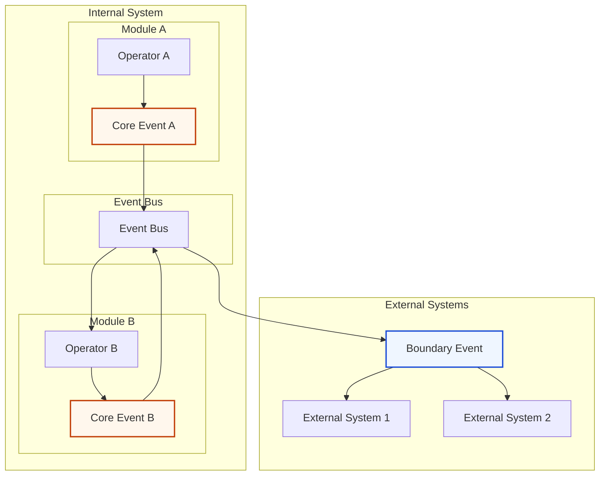

# Event-Driven Communication Pattern

## Intent
Enable loose coupling between components and modules by communicating through events rather than direct method calls, supporting both internal coordination and external integration.

## Problem
- Direct method calls create tight coupling between components
- Changes in one component ripple through dependent components
- Cross-module communication becomes complex and brittle
- Side effects scattered throughout business logic
- Difficult to add new functionality without modifying existing code

## Solution
Use events to communicate state changes and trigger side effects, with two distinct event types: Core Events for internal communication and Boundary Events for external integration.

## Structure



## Implementation

### 1. Core Events (Internal Communication)

#### Event Definitions
```typescript
// core-abstractions/events/user.core-events.ts
export abstract class CoreEvent {
  public readonly eventId: string;
  public readonly occurredAt: Date;
  public readonly eventVersion: number;

  constructor(eventVersion: number = 1) {
    this.eventId = crypto.randomUUID();
    this.occurredAt = new Date();
    this.eventVersion = eventVersion;
  }

  abstract get eventType(): string;
}

export class UserRegisteredEvent extends CoreEvent {
  constructor(
    public readonly userId: string,
    public readonly userEmail: string,
    public readonly registrationSource: string
  ) {
    super(1);
  }

  get eventType(): string {
    return 'UserRegistered';
  }
}

export class UserEmailChangedEvent extends CoreEvent {
  constructor(
    public readonly userId: string,
    public readonly oldEmail: string,
    public readonly newEmail: string,
    public readonly changedBy: string
  ) {
    super(1);
  }

  get eventType(): string {
    return 'UserEmailChanged';
  }
}

export class UserDeactivatedEvent extends CoreEvent {
  constructor(
    public readonly userId: string,
    public readonly reason: string,
    public readonly deactivatedBy: string
  ) {
    super(1);
  }

  get eventType(): string {
    return 'UserDeactivated';
  }
}
```

#### Event Bus Port
```typescript
// core-abstractions/ports/event-bus.ts
export interface IEventBus {
  // Publishing events
  emit(event: CoreEvent): Promise<void>;
  emitMany(events: CoreEvent[]): Promise<void>;

  // Subscribing to events
  subscribe<T extends CoreEvent>(
    eventType: string,
    handler: EventHandler<T>
  ): Subscription;

  // Lifecycle management
  start(): Promise<void>;
  stop(): Promise<void>;
  isHealthy(): Promise<boolean>;
}

export interface EventHandler<T extends CoreEvent> {
  handle(event: T): Promise<void>;
}

export interface Subscription {
  unsubscribe(): void;
}
```

#### Operator Emitting Events
```typescript
// operators/user.operator.ts
export class UserOperator {
  constructor(
    private userRepository: IUserRepository,
    private eventBus: IEventBus
  ) {}

  async registerUser(dto: RegisterUserDto): Promise<UserResponseDto> {
    // Business logic
    const user = User.create(dto);
    await this.userRepository.save(user);

    // Emit core event for internal coordination
    await this.eventBus.emit(new UserRegisteredEvent(
      user.id.value,
      user.email.value,
      dto.registrationSource || 'web'
    ));

    return this.mapToResponseDto(user);
  }

  async changeUserEmail(userId: string, newEmail: string): Promise<UserResponseDto> {
    const user = await this.userRepository.findById(UserId.fromString(userId));
    if (!user) {
      throw new Error('User not found');
    }

    const oldEmail = user.email.value;
    const updatedUser = user.updateEmail(new Email(newEmail));
    await this.userRepository.save(updatedUser);

    // Emit event with old and new values
    await this.eventBus.emit(new UserEmailChangedEvent(
      userId,
      oldEmail,
      newEmail,
      'user' // Could be 'admin', 'system', etc.
    ));

    return this.mapToResponseDto(updatedUser);
  }
}
```

#### Event Handlers for Side Effects
```typescript
// operators/email-notification.handler.ts
export class EmailNotificationHandler implements EventHandler<UserRegisteredEvent> {
  constructor(
    private emailService: IEmailService,
    private userRepository: IUserRepository
  ) {}

  async handle(event: UserRegisteredEvent): Promise<void> {
    // Send welcome email as side effect
    const user = await this.userRepository.findById(UserId.fromString(event.userId));
    if (user) {
      await this.emailService.sendWelcomeEmail(
        user.email,
        user.fullName.value
      );
    }
  }
}

// operators/user-analytics.handler.ts
export class UserAnalyticsHandler implements EventHandler<UserRegisteredEvent> {
  constructor(private analyticsService: IAnalyticsService) {}

  async handle(event: UserRegisteredEvent): Promise<void> {
    // Track registration in analytics
    await this.analyticsService.track('user_registered', {
      userId: event.userId,
      source: event.registrationSource,
      timestamp: event.occurredAt
    });
  }
}

// Cross-module event handler
// operators/order-user-handler.ts (in Orders module)
export class OrderUserHandler {
  constructor(private orderRepository: IOrderRepository) {}

  @EventHandler('UserDeactivated')
  async handleUserDeactivated(event: UserDeactivatedEvent): Promise<void> {
    // Cancel pending orders for deactivated user
    const pendingOrders = await this.orderRepository.findPendingOrdersByUser(
      UserId.fromString(event.userId)
    );

    for (const order of pendingOrders) {
      const cancelledOrder = order.cancel('User account deactivated');
      await this.orderRepository.save(cancelledOrder);
    }
  }
}
```

### 2. Boundary Events (External Communication)

#### Event Definitions
```typescript
// boundary/events/user.boundary-events.ts
export abstract class BoundaryEvent {
  public readonly eventId: string;
  public readonly timestamp: string; // ISO string for external systems
  public readonly version: string;

  constructor(version: string = '1.0') {
    this.eventId = crypto.randomUUID();
    this.timestamp = new Date().toISOString();
    this.version = version;
  }

  abstract get eventType(): string;
  abstract toExternalFormat(): any;
}

export class UserRegisteredBoundaryEvent extends BoundaryEvent {
  constructor(
    public readonly userId: string,
    public readonly email: string,
    public readonly fullName: string,
    public readonly registrationDate: string,
    public readonly source: string
  ) {
    super('1.0');
  }

  get eventType(): string {
    return 'user.registered';
  }

  toExternalFormat(): any {
    return {
      event_type: this.eventType,
      event_id: this.eventId,
      timestamp: this.timestamp,
      version: this.version,
      data: {
        user_id: this.userId,
        email: this.email,
        full_name: this.fullName,
        registration_date: this.registrationDate,
        source: this.source
      }
    };
  }
}

export class UserProfileUpdatedBoundaryEvent extends BoundaryEvent {
  constructor(
    public readonly userId: string,
    public readonly changes: Array<{
      field: string;
      oldValue: any;
      newValue: any;
    }>
  ) {
    super('1.0');
  }

  get eventType(): string {
    return 'user.profile.updated';
  }

  toExternalFormat(): any {
    return {
      event_type: this.eventType,
      event_id: this.eventId,
      timestamp: this.timestamp,
      version: this.version,
      data: {
        user_id: this.userId,
        changes: this.changes
      }
    };
  }
}
```

#### External Event Publisher
```typescript
// implementations/events/external-event-publisher.ts
export class ExternalEventPublisher {
  constructor(
    private webhookService: IWebhookService,
    private messageQueue: IMessageQueue
  ) {}

  async publishBoundaryEvent(event: BoundaryEvent): Promise<void> {
    const externalFormat = event.toExternalFormat();

    // Publish to multiple external systems
    await Promise.all([
      this.publishToWebhooks(externalFormat),
      this.publishToMessageQueue(externalFormat),
      this.publishToEventStore(externalFormat)
    ]);
  }

  private async publishToWebhooks(eventData: any): Promise<void> {
    const webhooks = await this.webhookService.getActiveWebhooks(eventData.event_type);

    await Promise.all(
      webhooks.map(webhook =>
        this.webhookService.send(webhook.url, eventData)
      )
    );
  }

  private async publishToMessageQueue(eventData: any): Promise<void> {
    await this.messageQueue.publish(eventData.event_type, eventData);
  }

  private async publishToEventStore(eventData: any): Promise<void> {
    // Store for event sourcing, audit, replay
    await this.eventStore.append(eventData);
  }
}
```

#### Event Translation Handler
```typescript
// operators/event-translation.handler.ts
export class EventTranslationHandler {
  constructor(private externalEventPublisher: ExternalEventPublisher) {}

  @EventHandler('UserRegistered')
  async handleUserRegistered(event: UserRegisteredEvent): Promise<void> {
    // Translate Core Event to Boundary Event
    const boundaryEvent = new UserRegisteredBoundaryEvent(
      event.userId,
      event.userEmail,
      '', // Would need to fetch full name
      event.occurredAt.toISOString(),
      event.registrationSource
    );

    await this.externalEventPublisher.publishBoundaryEvent(boundaryEvent);
  }

  @EventHandler('UserEmailChanged')
  async handleUserEmailChanged(event: UserEmailChangedEvent): Promise<void> {
    const boundaryEvent = new UserProfileUpdatedBoundaryEvent(
      event.userId,
      [{
        field: 'email',
        oldValue: event.oldEmail,
        newValue: event.newEmail
      }]
    );

    await this.externalEventPublisher.publishBoundaryEvent(boundaryEvent);
  }
}
```

### 3. Event Bus Implementation

#### In-Memory Event Bus
```typescript
// implementations/events/in-memory-event-bus.ts
export class InMemoryEventBus implements IEventBus {
  private handlers = new Map<string, EventHandler<any>[]>();
  private isRunning = false;

  async emit(event: CoreEvent): Promise<void> {
    const handlers = this.handlers.get(event.eventType) || [];

    // Execute handlers sequentially to maintain order
    for (const handler of handlers) {
      try {
        await handler.handle(event);
      } catch (error) {
        console.error(`Error handling event ${event.eventType}:`, error);
        // Continue with other handlers
      }
    }
  }

  async emitMany(events: CoreEvent[]): Promise<void> {
    for (const event of events) {
      await this.emit(event);
    }
  }

  subscribe<T extends CoreEvent>(
    eventType: string,
    handler: EventHandler<T>
  ): Subscription {
    if (!this.handlers.has(eventType)) {
      this.handlers.set(eventType, []);
    }

    this.handlers.get(eventType)!.push(handler);

    return {
      unsubscribe: () => {
        const handlers = this.handlers.get(eventType) || [];
        const index = handlers.indexOf(handler);
        if (index > -1) {
          handlers.splice(index, 1);
        }
      }
    };
  }

  async start(): Promise<void> {
    this.isRunning = true;
  }

  async stop(): Promise<void> {
    this.isRunning = false;
    this.handlers.clear();
  }

  async isHealthy(): Promise<boolean> {
    return this.isRunning;
  }
}
```

#### Message Queue Event Bus
```typescript
// implementations/events/message-queue-event-bus.ts
export class MessageQueueEventBus implements IEventBus {
  constructor(
    private messageQueue: IMessageQueue,
    private serializer: IEventSerializer
  ) {}

  async emit(event: CoreEvent): Promise<void> {
    const serialized = await this.serializer.serialize(event);
    await this.messageQueue.publish(event.eventType, serialized);
  }

  async emitMany(events: CoreEvent[]): Promise<void> {
    const serializedEvents = await Promise.all(
      events.map(event => this.serializer.serialize(event))
    );

    await this.messageQueue.publishBatch(serializedEvents);
  }

  subscribe<T extends CoreEvent>(
    eventType: string,
    handler: EventHandler<T>
  ): Subscription {
    return this.messageQueue.subscribe(eventType, async (message) => {
      const event = await this.serializer.deserialize<T>(message);
      await handler.handle(event);
    });
  }

  async start(): Promise<void> {
    await this.messageQueue.connect();
  }

  async stop(): Promise<void> {
    await this.messageQueue.disconnect();
  }

  async isHealthy(): Promise<boolean> {
    return await this.messageQueue.isConnected();
  }
}
```

### 4. Bootstrap Configuration

```typescript
// bootstrap/event-configuration.ts
export class EventConfiguration {
  static configure(container: DIContainer): void {
    // Register event bus
    container.register<IEventBus>('IEventBus', () => {
      return new InMemoryEventBus(); // or MessageQueueEventBus for production
    });

    // Register event handlers
    container.register<EmailNotificationHandler>('EmailNotificationHandler', () => {
      const emailService = container.resolve<IEmailService>('IEmailService');
      const userRepository = container.resolve<IUserRepository>('IUserRepository');
      return new EmailNotificationHandler(emailService, userRepository);
    });

    container.register<UserAnalyticsHandler>('UserAnalyticsHandler', () => {
      const analyticsService = container.resolve<IAnalyticsService>('IAnalyticsService');
      return new UserAnalyticsHandler(analyticsService);
    });

    // Register external event publisher
    container.register<ExternalEventPublisher>('ExternalEventPublisher', () => {
      const webhookService = container.resolve<IWebhookService>('IWebhookService');
      const messageQueue = container.resolve<IMessageQueue>('IMessageQueue');
      return new ExternalEventPublisher(webhookService, messageQueue);
    });

    // Register event translation handler
    container.register<EventTranslationHandler>('EventTranslationHandler', () => {
      const publisher = container.resolve<ExternalEventPublisher>('ExternalEventPublisher');
      return new EventTranslationHandler(publisher);
    });
  }

  static wireEventHandlers(container: DIContainer): void {
    const eventBus = container.resolve<IEventBus>('IEventBus');

    // Wire internal event handlers
    const emailHandler = container.resolve<EmailNotificationHandler>('EmailNotificationHandler');
    eventBus.subscribe('UserRegistered', emailHandler);

    const analyticsHandler = container.resolve<UserAnalyticsHandler>('UserAnalyticsHandler');
    eventBus.subscribe('UserRegistered', analyticsHandler);

    // Wire external event translation
    const translationHandler = container.resolve<EventTranslationHandler>('EventTranslationHandler');
    eventBus.subscribe('UserRegistered', translationHandler);
    eventBus.subscribe('UserEmailChanged', translationHandler);
  }
}
```

## Key Principles

### 1. Event Types Separation
- **Core Events**: Internal system coordination, rich domain context
- **Boundary Events**: External integration, stable format, versioned

### 2. Loose Coupling
- Publishers don't know about subscribers
- Easy to add new event handlers
- Cross-module communication without direct dependencies

### 3. Temporal Decoupling
- Events can be processed asynchronously
- Retry mechanisms for failed handlers
- Event replay capabilities

### 4. Single Responsibility
- Each event handler has one specific purpose
- Events are immutable records of what happened
- Clear event naming conventions

## Common Event Patterns

### 1. Saga Coordination
```typescript
export class OrderFulfillmentSaga {
  @EventHandler('OrderCreated')
  async handleOrderCreated(event: OrderCreatedEvent): Promise<void> {
    await this.eventBus.emit(new ReserveInventoryCommand(event.orderId));
  }

  @EventHandler('InventoryReserved')
  async handleInventoryReserved(event: InventoryReservedEvent): Promise<void> {
    await this.eventBus.emit(new ProcessPaymentCommand(event.orderId));
  }

  @EventHandler('PaymentProcessed')
  async handlePaymentProcessed(event: PaymentProcessedEvent): Promise<void> {
    await this.eventBus.emit(new ShipOrderCommand(event.orderId));
  }
}
```

### 2. Read Model Updates
```typescript
export class UserReadModelHandler {
  @EventHandler('UserRegistered')
  async updateUserList(event: UserRegisteredEvent): Promise<void> {
    await this.userListRepository.addUser({
      id: event.userId,
      email: event.userEmail,
      status: 'active',
      registeredAt: event.occurredAt
    });
  }

  @EventHandler('UserDeactivated')
  async removeFromActiveUsers(event: UserDeactivatedEvent): Promise<void> {
    await this.userListRepository.updateUserStatus(event.userId, 'inactive');
  }
}
```

### 3. Cross-Module Communication
```typescript
// In Orders module
export class OrderUserEventHandler {
  @EventHandler('UserDeactivated')
  async cancelUserOrders(event: UserDeactivatedEvent): Promise<void> {
    const pendingOrders = await this.orderRepository.findPendingByUser(event.userId);

    for (const order of pendingOrders) {
      await this.orderOperator.cancelOrder(order.id, 'User deactivated');
    }
  }
}
```

## Benefits

1. **Loose Coupling**: Components don't know about each other directly
2. **Extensibility**: Easy to add new features without modifying existing code
3. **Scalability**: Events can be processed asynchronously and distributed
4. **Audit Trail**: Complete history of what happened in the system
5. **Integration**: Clean way to communicate with external systems
6. **Testing**: Easy to test event handlers in isolation

## Anti-Patterns

### ❌ Event Chaining
```typescript
// DON'T: Create long chains of events
@EventHandler('UserRegistered')
async handle(event: UserRegisteredEvent): Promise<void> {
  await this.eventBus.emit(new SendWelcomeEmailEvent(event.userId));
  // This creates unnecessary event chain
}
```

### ❌ Business Logic in Events
```typescript
// DON'T: Put business logic in events
export class UserRegisteredEvent extends CoreEvent {
  calculateUserScore(): number { // Business logic in event
    return this.userData.age * this.userData.purchases;
  }
}
```

### ❌ Synchronous Processing
```typescript
// DON'T: Make event handling synchronous when it should be async
async registerUser(dto: RegisterUserDto): Promise<UserResponseDto> {
  const user = User.create(dto);
  await this.userRepository.save(user);

  // This blocks the main flow
  await this.sendWelcomeEmail(user);
  await this.updateAnalytics(user);
  await this.syncToExternalSystem(user);

  return this.mapToResponseDto(user);
}
```

## Best Practices

1. **Immutable Events**: Events should never change after creation
2. **Rich Context**: Include all relevant information in events
3. **Clear Naming**: Use past tense, business-meaningful names
4. **Versioning**: Version events for backward compatibility
5. **Error Handling**: Handle event processing failures gracefully
6. **Monitoring**: Track event processing metrics and failures
7. **Documentation**: Document event schemas and handling logic
8. **Testing**: Test event publishing and handling separately

This pattern enables highly decoupled, extensible, and maintainable systems while providing excellent integration capabilities.