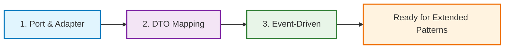

# Basic ADD Patterns

These are the fundamental patterns that form the core of Abstract Driven Development architecture. Master these patterns before moving to extended patterns.

## Available Patterns

### 🔌 [Port & Adapter Pattern](./Port_Adapter_Pattern.md)
**Foundation Pattern - Start Here**

Isolates business logic from external systems by defining clear interfaces (ports) and implementing adapters that handle technical details.

**When to Use:**
- Integrating with databases, APIs, messaging systems
- Need to swap implementations (dev/test/prod)
- Want technology-independent business logic

**Key Benefits:**
- Technology independence
- Easy testing with mocks
- Parallel development
- Future-proofing

---

### 🔄 [DTO ↔ Entity Mapping](./DTO_Entity_Mapping.md)
**API Boundary Pattern**

Transforms data between external system contracts (DTOs) and internal domain models (Entities) while maintaining clean boundaries.

**When to Use:**
- Building REST APIs
- External system integration
- Need stable API contracts
- Rich domain models required

**Key Benefits:**
- API stability
- Rich domain behavior
- Clean separation
- Backward compatibility

---

### 📡 [Event-Driven Communication](./Event_Driven_Communication.md)
**Decoupling Pattern**

Decouples components through asynchronous messaging, enabling loose coupling and scalable architectures.

**When to Use:**
- Need loose coupling between modules
- Cross-cutting concerns (logging, auditing)
- Notification systems
- Scalable architectures

**Key Benefits:**
- Loose coupling
- Scalability
- Extensibility
- System resilience

---

## Learning Order



## Pattern Integration

### How Basic Patterns Work Together

1. **Port & Adapter** provides the foundation:
   - Defines ports for external dependencies
   - Implements adapters for specific technologies
   - Enables technology independence

2. **DTO ↔ Entity Mapping** works within Port & Adapter:
   - Handles data transformation at boundaries
   - Keeps internal models rich and focused
   - Maintains API stability

3. **Event-Driven Communication** connects everything:
   - Decouples components
   - Enables asynchronous processing
   - Supports cross-cutting concerns

### Real-World Example: User Registration

```typescript
// 1. Port & Adapter - Define interfaces
interface IUserRepository {
  save(user: User): Promise<void>;
  findByEmail(email: Email): Promise<User | null>;
}

interface IEmailService {
  sendWelcomeEmail(email: Email, name: string): Promise<void>;
}

// 2. DTO Mapping - Handle external contracts
export class UserOperator {
  async registerUser(dto: CreateUserDto): Promise<UserResponseDto> {
    // DTO → Entity
    const user = User.create(dto);

    await this.userRepository.save(user);

    // 3. Event-Driven - Notify other components
    await this.eventBus.emit(new UserRegisteredEvent(user.id.value));

    // Entity → DTO
    return this.mapToResponseDto(user);
  }
}
```

## Implementation Guidelines

### Code Quality Standards
- **TypeScript** with strict typing
- **Immutable entities** where possible
- **Pure functions** for transformations
- **Dependency Injection** for loose coupling
- **Unit tests** for all business logic

### File Organization
```
src/
├── boundary/                 # External contracts
│   ├── dto/                 # Data Transfer Objects
│   └── controllers/         # HTTP/API controllers
├── core-abstractions/       # Business core
│   ├── entities/           # Domain entities
│   ├── value-objects/      # Value objects
│   ├── ports/              # Interface definitions
│   └── events/             # Domain events
├── operators/              # Business logic
│   └── *.operator.ts       # Business orchestration
├── implementations/        # Technical details
│   ├── repositories/       # Data access adapters
│   ├── services/           # External service adapters
│   └── event-handlers/     # Event processing
└── bootstrap/              # Configuration
    └── container.ts        # Dependency injection
```

## Next Steps

After mastering these basic patterns:

1. **Practice Implementation**: Build a simple CRUD application using all three patterns
2. **Study Examples**: Review the [examples folder](../../examples/) for complete implementations
3. **Learn Extended Patterns**: Move to [extended patterns](../extended/) for complex scenarios
4. **Join Community**: Contribute to pattern discussions and improvements

## Common Questions

**Q: Which pattern should I learn first?**
A: Start with Port & Adapter as it's the foundation. Then DTO Mapping, finally Event-Driven.

**Q: Do I need all three patterns?**
A: Port & Adapter is essential. DTO Mapping is needed for APIs. Event-Driven is optional but recommended for scalability.

**Q: Can I use these patterns with other architectures?**
A: Yes! These patterns complement Clean Architecture, Hexagonal Architecture, and DDD.

**Q: What if my application is simple?**
A: Even simple applications benefit from Port & Adapter. Add others as complexity grows.

---

[← Back to All Patterns](../README.md) | [Extended Patterns →](../extended/README.md)