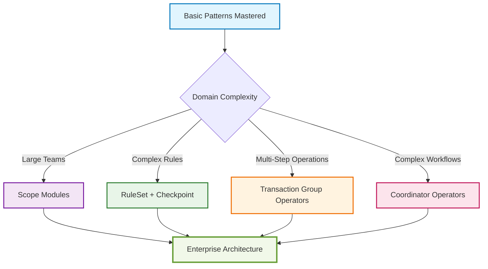

# Extended ADD Patterns

Advanced patterns for complex enterprise scenarios. These patterns build upon the basic patterns and address sophisticated business requirements in large-scale applications.

## Prerequisites

Before using extended patterns, ensure you understand:
- ✅ [Basic ADD Patterns](../basic/README.md)
- ✅ [5-layer ADD Architecture](../../theories/v3/ADD%20Theory%20V3.en.md)
- ✅ [Dependency Inversion Principle](../../principles/)

## Available Patterns

### 🏗️ [Scope Modules](./Scope_Modules.md)
**Domain Organization Pattern**

Organizes complex domains into manageable sub-systems with clear boundaries, enabling multiple teams to work in parallel.

**When to Use:**
- Large applications with multiple domains
- Multiple development teams
- Need clear architectural boundaries
- Complex business rules spanning domains

**Key Benefits:**
- Clear team boundaries
- Parallel development
- Reduced complexity
- Independent deployment

**Complexity:** ⭐⭐⭐⭐⭐ (High)

---

### ⚡ [RuleSet + Checkpoint](./RuleSet_Checkpoint.md)
**Business Rules Pattern**

Implements flexible, composable business rule validation with configurable checkpoints for complex decision-making scenarios.

**When to Use:**
- Complex, changing business rules
- Multiple validation scenarios
- Need rule composition
- Compliance requirements

**Key Benefits:**
- Rule flexibility
- Easy composition
- Clear validation logic
- Compliance tracking

**Complexity:** ⭐⭐⭐ (Medium)

---

### 🔄 [Transaction Group Operators (TGO)](./Transaction_Group_Operators.md)
**Transaction Coordination Pattern**

Coordinates multiple business operations as a single atomic unit, ensuring either all operations succeed or all are rolled back.

**When to Use:**
- Multi-step business processes
- Need transactional consistency
- Complex operations spanning multiple aggregates
- Compensation logic required

**Key Benefits:**
- Data consistency
- Error recovery
- Clear transaction boundaries
- Systematic rollback

**Complexity:** ⭐⭐⭐⭐ (High)

---

### 🎯 [Coordinator Operators](./Coordinator_Operators.md)
**Workflow Orchestration Pattern**

Orchestrates complex business workflows by coordinating multiple operators and external systems while maintaining loose coupling.

**When to Use:**
- Complex business workflows
- Process automation
- Dynamic business processes
- Multiple system integration

**Key Benefits:**
- Process flexibility
- Clear orchestration
- Workflow visibility
- System integration

**Complexity:** ⭐⭐⭐⭐⭐ (High)

---

## Pattern Selection Matrix

| Scenario | Recommended Pattern | Alternative | Why |
|----------|-------------------|-------------|-----|
| Large team, multiple domains | Scope Modules | - | Essential for team coordination |
| Complex validation rules | RuleSet + Checkpoint | Custom validators | Flexibility and maintainability |
| Multi-step transactions | TGO | Manual rollback | Data consistency guarantees |
| Complex workflows | Coordinator | Hard-coded logic | Process flexibility |
| Simple business logic | [Basic Patterns](../basic/) | - | Avoid over-engineering |

## Learning Path



## Pattern Combinations

### Typical Enterprise Stack

1. **Foundation Layer**
   ```
   Basic Patterns (Port & Adapter, DTO Mapping, Event-Driven)
   ```

2. **Domain Organization**
   ```
   Scope Modules (for large domains)
   ```

3. **Business Logic Layer**
   ```
   RuleSet + Checkpoint (complex rules)
   Transaction Group Operators (multi-step operations)
   ```

4. **Process Layer**
   ```
   Coordinator Operators (workflow orchestration)
   ```

### Real-World Example: E-commerce Platform

```typescript
// 1. Scope Modules - Organize domains
@ScopeModule('order-management')
export class OrderManagementScope {
  // Order-related operators and logic
}

@ScopeModule('inventory-management')
export class InventoryManagementScope {
  // Inventory-related operators and logic
}

// 2. RuleSet + Checkpoint - Validate complex rules
export class OrderValidationCheckpoint extends Checkpoint {
  async validate(order: Order): Promise<CheckpointResult> {
    const ruleSet = new OrderValidationRuleSet([
      new CreditLimitRule(),
      new InventoryAvailabilityRule(),
      new FraudDetectionRule()
    ]);

    return await ruleSet.execute(order);
  }
}

// 3. TGO - Coordinate multi-step operations
export class OrderFulfillmentTGO {
  async fulfillOrder(dto: FulfillOrderDto): Promise<OrderResult> {
    // Atomic multi-step operation with rollback
  }
}

// 4. Coordinator - Orchestrate complex workflows
export class OrderProcessingCoordinator {
  async processOrderWorkflow(dto: ProcessOrderDto): Promise<WorkflowResult> {
    // Complex workflow orchestration
  }
}
```

## Implementation Guidelines

### Architecture Principles

1. **Layered Composition**
   - Extended patterns build on basic patterns
   - Each layer adds specific capabilities
   - Maintain clear separation of concerns

2. **Incremental Adoption**
   - Start with basic patterns
   - Add extended patterns as complexity grows
   - Don't over-engineer simple scenarios

3. **Team Boundaries**
   - Use Scope Modules for team organization
   - Clear interfaces between scopes
   - Independent testing and deployment

### Performance Considerations

| Pattern | Performance Impact | Mitigation Strategies |
|---------|-------------------|----------------------|
| Scope Modules | Low | Proper module lazy loading |
| RuleSet + Checkpoint | Medium | Rule caching, parallel execution |
| TGO | High | Short transactions, async processing |
| Coordinator | Medium | Async workflows, state persistence |

### Testing Strategies

```typescript
// Unit Testing - Test each pattern in isolation
describe('RuleSet', () => {
  it('should execute rules in sequence', async () => {
    const ruleSet = new TestRuleSet([mockRule1, mockRule2]);
    const result = await ruleSet.execute(testData);
    expect(result.success).toBe(true);
  });
});

// Integration Testing - Test pattern combinations
describe('Order Processing Integration', () => {
  it('should process order through full workflow', async () => {
    const coordinator = new OrderProcessingCoordinator(
      mockTGO,
      mockCheckpoint,
      mockScopeModule
    );
    const result = await coordinator.processOrder(testOrder);
    expect(result.status).toBe('COMPLETED');
  });
});
```

## Migration Guide

### From Basic to Extended Patterns

1. **Assessment Phase**
   - Identify complexity pain points
   - Map current architecture
   - Define migration goals

2. **Incremental Migration**
   ```typescript
   // Before: Simple operator
   export class OrderOperator {
     async createOrder(dto: CreateOrderDto) {
       // Simple business logic
     }
   }

   // After: Extended patterns
   export class OrderProcessingCoordinator {
     constructor(
       private orderTGO: OrderFulfillmentTGO,
       private validationCheckpoint: OrderValidationCheckpoint
     ) {}

     async processOrder(dto: ProcessOrderDto) {
       // Complex workflow with extended patterns
     }
   }
   ```

3. **Pattern Selection**
   - Start with least complex extended pattern
   - Gradually introduce more advanced patterns
   - Measure impact and benefits

## Common Anti-Patterns

### ❌ Over-Engineering
```typescript
// DON'T: Use complex patterns for simple scenarios
class SimpleUserRegistrationCoordinator extends CoordinatorOperator {
  // Complex workflow for simple user creation
}

// DO: Use appropriate complexity level
class UserOperator {
  async registerUser(dto: CreateUserDto): Promise<UserResponseDto> {
    // Simple business logic for simple scenario
  }
}
```

### ❌ Pattern Mixing Without Purpose
```typescript
// DON'T: Combine patterns without clear benefit
class OverComplexOperator extends TGO {
  constructor(
    private coordinator: SomeCoordinator,
    private checkpoint: SomeCheckpoint,
    private scopeModule: SomeScope
  ) {
    // Using all patterns without clear purpose
  }
}
```

## Best Practices

1. **Start Simple**: Begin with basic patterns, add complexity as needed
2. **Clear Boundaries**: Define clear responsibilities for each pattern
3. **Consistent Naming**: Use clear, descriptive names for pattern implementations
4. **Documentation**: Document pattern usage and decisions
5. **Testing**: Comprehensive testing at each pattern level
6. **Performance**: Monitor and optimize pattern interactions
7. **Team Training**: Ensure team understands pattern purposes and usage

## Next Steps

1. **Choose Your Starting Point**: Based on your complexity needs
2. **Study Examples**: Review [examples folder](../../examples/extended/)
3. **Start Implementation**: Begin with least complex pattern for your scenario
4. **Measure Impact**: Track benefits and challenges
5. **Iterate**: Gradually adopt additional patterns as needed

## Support and Resources

- 📚 [Complete Examples](../../examples/extended/) - Working implementations
- 🎯 [Training Materials](../../presentations/advanced-patterns/) - Team training
- 📖 [Theory Background](../../theories/v3/ADD%20Theory%20V3.en.md) - Theoretical foundation
- 💬 [Community Discussions](../../discussions/) - Q&A and best practices

---

[← Basic Patterns](../basic/README.md) | [Back to All Patterns ↑](../README.md)