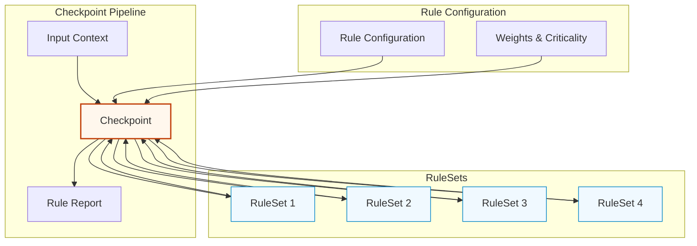

# RuleSet + Checkpoint Pattern (ADD-Extended)

## Intent
Compose complex business rule validation using pure, testable functions (RuleSets) combined into pipelines (Checkpoints) that provide comprehensive validation with detailed reporting.

## Problem
- Business rules are scattered throughout the codebase
- Complex validation logic is hard to test and maintain
- Rule changes require modifications in multiple places
- Difficult to understand why validation failed
- Rules are tightly coupled to specific use cases

## Solution
Create pure RuleSet functions that evaluate specific business rules and combine them into Checkpoints that orchestrate rule execution, collect results, and provide detailed reporting.

## Structure



## Implementation

### 1. RuleSet Foundation

#### Base Interfaces
```typescript
// core-abstractions/types/ruleset.types.ts
export interface RuleReport {
  ruleName: string;
  passed: boolean;
  reasons: string[];
  evaluatedAt: Date;
  executionTimeMs?: number;
  confidence?: number;  // 0-100, how confident we are in this result
  metadata?: Record<string, any>;
}

export interface RuleSet<TContext = any> {
  evaluate(context: TContext): Promise<RuleReport>;
}

export interface Checkpoint<TContext = any> {
  addRule(rule: RuleSet<TContext>, weight?: number, critical?: boolean): Checkpoint<TContext>;
  removeRule(ruleType: any): Checkpoint<TContext>;
  run(context: TContext): Promise<RuleReport>;
}

export interface RuleContext {
  // Base context that all rules can access
  timestamp: Date;
  userId?: string;
  sessionId?: string;
  traceId?: string;
}
```

### 2. Individual RuleSets

#### Credit Limit RuleSet
```typescript
// core-abstractions/rulesets/credit-limit.ruleset.ts
export interface CreditLimitContext extends RuleContext {
  customer: {
    id: string;
    creditLimit: number;
    currentDebt: number;
    creditScore: number;
  };
  requestedAmount: number;
  orderType: 'regular' | 'subscription' | 'bulk';
}

export class CreditLimitRuleSet implements RuleSet<CreditLimitContext> {
  constructor(
    private creditBufferPercentage: number = 0.1, // 10% buffer
    private minimumCreditScore: number = 600
  ) {}

  async evaluate(context: CreditLimitContext): Promise<RuleReport> {
    const startTime = Date.now();
    const reasons: string[] = [];
    let passed = true;
    let confidence = 100;

    // Rule 1: Basic credit limit check
    const availableCredit = context.customer.creditLimit - context.customer.currentDebt;
    const requiredCredit = context.requestedAmount;

    if (requiredCredit > availableCredit) {
      passed = false;
      reasons.push(
        `Insufficient credit: Available $${availableCredit.toFixed(2)}, ` +
        `Required $${requiredCredit.toFixed(2)}`
      );
    }

    // Rule 2: Credit buffer for regular customers
    const bufferAmount = context.customer.creditLimit * this.creditBufferPercentage;
    const effectiveLimit = context.customer.creditLimit - bufferAmount;
    const projectedDebt = context.customer.currentDebt + requiredCredit;

    if (projectedDebt > effectiveLimit && context.customer.creditScore < 750) {
      passed = false;
      reasons.push(
        `Credit buffer violation: Projected debt $${projectedDebt.toFixed(2)} ` +
        `exceeds safe limit $${effectiveLimit.toFixed(2)} for credit score ${context.customer.creditScore}`
      );
    }

    // Rule 3: Minimum credit score requirement
    if (context.customer.creditScore < this.minimumCreditScore) {
      passed = false;
      confidence = Math.max(confidence - 30, 0);
      reasons.push(
        `Credit score ${context.customer.creditScore} below minimum requirement ${this.minimumCreditScore}`
      );
    }

    // Rule 4: Special handling for bulk orders
    if (context.orderType === 'bulk' && requiredCredit > context.customer.creditLimit * 0.5) {
      if (context.customer.creditScore < 700) {
        passed = false;
        reasons.push(
          `Bulk order requires credit score ≥700 for amounts over 50% of credit limit. ` +
          `Current score: ${context.customer.creditScore}`
        );
      }
    }

    // Rule 5: Subscription order validation
    if (context.orderType === 'subscription') {
      const monthlyCommitment = requiredCredit; // Assuming monthly billing
      const maxSubscriptionRatio = 0.3; // Max 30% of credit limit for subscriptions

      if (monthlyCommitment > context.customer.creditLimit * maxSubscriptionRatio) {
        passed = false;
        reasons.push(
          `Subscription amount $${monthlyCommitment.toFixed(2)} exceeds maximum ` +
          `subscription ratio (30% of credit limit = $${(context.customer.creditLimit * maxSubscriptionRatio).toFixed(2)})`
        );
      }
    }

    const executionTime = Date.now() - startTime;

    return {
      ruleName: 'CreditLimitRuleSet',
      passed,
      reasons,
      evaluatedAt: context.timestamp,
      executionTimeMs: executionTime,
      confidence,
      metadata: {
        customerId: context.customer.id,
        creditUtilization: (projectedDebt / context.customer.creditLimit) * 100,
        availableCredit,
        requestedAmount: requiredCredit,
        orderType: context.orderType,
        creditScore: context.customer.creditScore
      }
    };
  }
}
```

#### Fraud Detection RuleSet
```typescript
// core-abstractions/rulesets/fraud-detection.ruleset.ts
export interface FraudDetectionContext extends RuleContext {
  customer: {
    id: string;
    accountAge: number; // days
    averageOrderValue: number;
    orderFrequency: number; // orders per month
    lastOrderDate?: Date;
    trustScore: number; // 0-100
  };
  order: {
    amount: number;
    items: Array<{
      productId: string;
      quantity: number;
      unitPrice: number;
      category: string;
    }>;
    shippingAddress: {
      country: string;
      region: string;
      isNewAddress: boolean;
    };
    billingAddress: {
      country: string;
      region: string;
    };
  };
  session: {
    ipAddress: string;
    userAgent: string;
    deviceFingerprint?: string;
    vpnDetected: boolean;
  };
}

export class FraudDetectionRuleSet implements RuleSet<FraudDetectionContext> {
  constructor(
    private riskThresholds: {
      highValueMultiplier: number;
      newAccountDays: number;
      velocityLimit: number;
      trustScoreThreshold: number;
    } = {
      highValueMultiplier: 3.0,
      newAccountDays: 30,
      velocityLimit: 5,
      trustScoreThreshold: 40
    }
  ) {}

  async evaluate(context: FraudDetectionContext): Promise<RuleReport> {
    const startTime = Date.now();
    const reasons: string[] = [];
    let passed = true;
    let riskScore = 0;
    const maxRiskScore = 100;

    // Rule 1: Order value vs. customer profile
    const valueMultiplier = context.order.amount / Math.max(context.customer.averageOrderValue, 1);
    if (valueMultiplier > this.riskThresholds.highValueMultiplier) {
      riskScore += 25;
      reasons.push(
        `Order value $${context.order.amount} is ${valueMultiplier.toFixed(1)}x ` +
        `higher than customer's average ($${context.customer.averageOrderValue})`
      );
    }

    // Rule 2: New account risk
    if (context.customer.accountAge < this.riskThresholds.newAccountDays) {
      riskScore += 20;
      reasons.push(
        `New account risk: Account age ${context.customer.accountAge} days ` +
        `(threshold: ${this.riskThresholds.newAccountDays} days)`
      );
    }

    // Rule 3: Geographic mismatch
    if (context.order.shippingAddress.country !== context.order.billingAddress.country) {
      riskScore += 15;
      reasons.push(
        `Geographic mismatch: Shipping to ${context.order.shippingAddress.country}, ` +
        `billing from ${context.order.billingAddress.country}`
      );
    }

    // Rule 4: VPN usage
    if (context.session.vpnDetected) {
      riskScore += 10;
      reasons.push('VPN or proxy usage detected');
    }

    // Rule 5: Order velocity check
    const hoursSinceLastOrder = context.customer.lastOrderDate
      ? (context.timestamp.getTime() - context.customer.lastOrderDate.getTime()) / (1000 * 60 * 60)
      : Infinity;

    if (hoursSinceLastOrder < 1) { // Less than 1 hour
      riskScore += 30;
      reasons.push(`High velocity: Previous order placed ${hoursSinceLastOrder.toFixed(1)} hours ago`);
    }

    // Rule 6: Unusual item patterns
    const highValueItems = context.order.items.filter(item => item.unitPrice > 500);
    const electronicItems = context.order.items.filter(item =>
      item.category.toLowerCase().includes('electronics')
    );

    if (highValueItems.length > 3 && context.customer.accountAge < 90) {
      riskScore += 20;
      reasons.push(
        `Suspicious item pattern: ${highValueItems.length} high-value items for account ` +
        `age ${context.customer.accountAge} days`
      );
    }

    // Rule 7: Trust score consideration
    if (context.customer.trustScore < this.riskThresholds.trustScoreThreshold) {
      riskScore += 25;
      reasons.push(
        `Low trust score: ${context.customer.trustScore} ` +
        `(threshold: ${this.riskThresholds.trustScoreThreshold})`
      );
    }

    // Rule 8: New shipping address with high-value order
    if (context.order.shippingAddress.isNewAddress && context.order.amount > 1000) {
      riskScore += 15;
      reasons.push('High-value order to new shipping address');
    }

    // Final risk assessment
    const riskPercentage = Math.min(riskScore, maxRiskScore);
    passed = riskPercentage < 50; // Fail if risk score >= 50%

    const executionTime = Date.now() - startTime;

    return {
      ruleName: 'FraudDetectionRuleSet',
      passed,
      reasons: passed ? [] : reasons,
      evaluatedAt: context.timestamp,
      executionTimeMs: executionTime,
      confidence: Math.max(100 - riskPercentage, 0),
      metadata: {
        riskScore: riskPercentage,
        riskFactors: reasons.length,
        customerId: context.customer.id,
        orderAmount: context.order.amount,
        accountAge: context.customer.accountAge,
        trustScore: context.customer.trustScore,
        geographicMismatch: context.order.shippingAddress.country !== context.order.billingAddress.country,
        vpnDetected: context.session.vpnDetected
      }
    };
  }
}
```

#### Inventory Availability RuleSet
```typescript
// core-abstractions/rulesets/inventory-availability.ruleset.ts
export interface InventoryContext extends RuleContext {
  requestedItems: Array<{
    productId: string;
    quantity: number;
    priority: 'standard' | 'express' | 'bulk';
  }>;
  inventory: Map<string, {
    availableQuantity: number;
    reservedQuantity: number;
    incomingQuantity: number;
    expectedArrival?: Date;
    minimumStock: number;
    category: string;
  }>;
  customerTier: 'bronze' | 'silver' | 'gold' | 'platinum';
}

export class InventoryAvailabilityRuleSet implements RuleSet<InventoryContext> {
  async evaluate(context: InventoryContext): Promise<RuleReport> {
    const startTime = Date.now();
    const reasons: string[] = [];
    let passed = true;
    let availabilityScore = 100;

    const unavailableItems: string[] = [];
    const partiallyAvailableItems: Array<{
      productId: string;
      requested: number;
      available: number;
    }> = [];

    for (const requestedItem of context.requestedItems) {
      const inventory = context.inventory.get(requestedItem.productId);

      if (!inventory) {
        passed = false;
        unavailableItems.push(requestedItem.productId);
        reasons.push(`Product ${requestedItem.productId} not found in inventory`);
        continue;
      }

      // Rule 1: Basic availability check
      if (inventory.availableQuantity < requestedItem.quantity) {
        // Check if partial fulfillment is acceptable
        if (inventory.availableQuantity === 0) {
          passed = false;
          unavailableItems.push(requestedItem.productId);
          reasons.push(
            `Product ${requestedItem.productId} is out of stock ` +
            `(requested: ${requestedItem.quantity}, available: 0)`
          );
        } else {
          // Partial availability
          partiallyAvailableItems.push({
            productId: requestedItem.productId,
            requested: requestedItem.quantity,
            available: inventory.availableQuantity
          });

          // For express orders, partial fulfillment may not be acceptable
          if (requestedItem.priority === 'express') {
            passed = false;
            reasons.push(
              `Express order requires full quantity for ${requestedItem.productId} ` +
              `(requested: ${requestedItem.quantity}, available: ${inventory.availableQuantity})`
            );
          }
        }
      }

      // Rule 2: Minimum stock maintenance
      const remainingAfterOrder = inventory.availableQuantity - requestedItem.quantity;
      if (remainingAfterOrder < inventory.minimumStock) {
        // Priority customers get preference
        if (context.customerTier === 'bronze' || context.customerTier === 'silver') {
          passed = false;
          reasons.push(
            `Order would violate minimum stock for ${requestedItem.productId}. ` +
            `Remaining: ${remainingAfterOrder}, Minimum: ${inventory.minimumStock}. ` +
            `Priority reserved for Gold/Platinum customers.`
          );
        } else {
          // Allow but reduce confidence
          availabilityScore -= 10;
          reasons.push(
            `Warning: Order for ${requestedItem.productId} will result in low stock ` +
            `(remaining: ${remainingAfterOrder}, minimum: ${inventory.minimumStock})`
          );
        }
      }

      // Rule 3: Category-specific rules
      if (inventory.category === 'limited-edition' && requestedItem.quantity > 1) {
        if (context.customerTier !== 'platinum') {
          passed = false;
          reasons.push(
            `Limited edition item ${requestedItem.productId} restricted to 1 per customer ` +
            `for non-Platinum members`
          );
        }
      }

      // Rule 4: Bulk order validation
      if (requestedItem.priority === 'bulk') {
        const bulkThreshold = Math.floor(inventory.availableQuantity * 0.8); // 80% of stock
        if (requestedItem.quantity > bulkThreshold) {
          if (context.customerTier !== 'gold' && context.customerTier !== 'platinum') {
            passed = false;
            reasons.push(
              `Bulk order for ${requestedItem.productId} requires Gold or Platinum membership ` +
              `for quantities over ${bulkThreshold}`
            );
          }
        }
      }
    }

    // Rule 5: Incoming stock consideration
    const canWaitForStock = context.requestedItems.some(item => {
      const inventory = context.inventory.get(item.productId);
      return inventory?.expectedArrival &&
             inventory.expectedArrival <= new Date(Date.now() + 7 * 24 * 60 * 60 * 1000); // Within 7 days
    });

    if (!passed && canWaitForStock && context.customerTier === 'platinum') {
      // Platinum customers get pre-order option
      reasons.push('Pre-order option available for Platinum customers with incoming stock');
      availabilityScore += 20;
    }

    const executionTime = Date.now() - startTime;

    return {
      ruleName: 'InventoryAvailabilityRuleSet',
      passed,
      reasons,
      evaluatedAt: context.timestamp,
      executionTimeMs: executionTime,
      confidence: Math.max(availabilityScore, 0),
      metadata: {
        totalItemsRequested: context.requestedItems.length,
        unavailableItems: unavailableItems.length,
        partiallyAvailableItems: partiallyAvailableItems.length,
        customerTier: context.customerTier,
        canWaitForStock,
        partialFulfillmentDetails: partiallyAvailableItems
      }
    };
  }
}
```

### 3. Checkpoint Implementation

#### Configurable Checkpoint
```typescript
// core-abstractions/checkpoints/configurable.checkpoint.ts
export class ConfigurableCheckpoint<TContext extends RuleContext> implements Checkpoint<TContext> {
  private rules: Array<{
    rule: RuleSet<TContext>;
    weight: number;
    critical: boolean;
    enabled: boolean;
    retryCount: number;
  }> = [];

  private config: {
    failFast: boolean; // Stop on first critical failure
    parallelExecution: boolean; // Run rules in parallel
    timeoutMs: number; // Max execution time per rule
    retryFailedRules: boolean; // Retry failed rules
  } = {
    failFast: false,
    parallelExecution: true,
    timeoutMs: 5000,
    retryFailedRules: false
  };

  constructor(config?: Partial<ConfigurableCheckpoint<TContext>['config']>) {
    if (config) {
      this.config = { ...this.config, ...config };
    }
  }

  addRule(
    rule: RuleSet<TContext>,
    weight: number = 1.0,
    critical: boolean = false
  ): Checkpoint<TContext> {
    this.rules.push({
      rule,
      weight,
      critical,
      enabled: true,
      retryCount: 0
    });
    return this;
  }

  removeRule(ruleType: any): Checkpoint<TContext> {
    this.rules = this.rules.filter(r => !(r.rule instanceof ruleType));
    return this;
  }

  enableRule(ruleType: any): Checkpoint<TContext> {
    const ruleEntry = this.rules.find(r => r.rule instanceof ruleType);
    if (ruleEntry) {
      ruleEntry.enabled = true;
    }
    return this;
  }

  disableRule(ruleType: any): Checkpoint<TContext> {
    const ruleEntry = this.rules.find(r => r.rule instanceof ruleType);
    if (ruleEntry) {
      ruleEntry.enabled = false;
    }
    return this;
  }

  async run(context: TContext): Promise<RuleReport> {
    const startTime = Date.now();
    const enabledRules = this.rules.filter(r => r.enabled);

    if (enabledRules.length === 0) {
      return {
        ruleName: 'ConfigurableCheckpoint',
        passed: true,
        reasons: ['No rules configured'],
        evaluatedAt: context.timestamp,
        executionTimeMs: 0,
        confidence: 100
      };
    }

    let individualReports: RuleReport[];

    if (this.config.parallelExecution) {
      individualReports = await this.executeRulesInParallel(enabledRules, context);
    } else {
      individualReports = await this.executeRulesSequentially(enabledRules, context);
    }

    return this.aggregateResults(individualReports, startTime, context);
  }

  private async executeRulesInParallel(
    rules: Array<{ rule: RuleSet<TContext>; weight: number; critical: boolean }>,
    context: TContext
  ): Promise<RuleReport[]> {
    const promises = rules.map(async ({ rule, critical }) => {
      try {
        const timeoutPromise = new Promise<RuleReport>((_, reject) =>
          setTimeout(() => reject(new Error('Rule execution timeout')), this.config.timeoutMs)
        );

        const rulePromise = rule.evaluate(context);
        return await Promise.race([rulePromise, timeoutPromise]);
      } catch (error) {
        return {
          ruleName: rule.constructor.name,
          passed: false,
          reasons: [`Rule execution failed: ${error.message}`],
          evaluatedAt: context.timestamp,
          executionTimeMs: this.config.timeoutMs,
          confidence: 0,
          metadata: { error: error.message, critical }
        };
      }
    });

    return await Promise.all(promises);
  }

  private async executeRulesSequentially(
    rules: Array<{ rule: RuleSet<TContext>; weight: number; critical: boolean }>,
    context: TContext
  ): Promise<RuleReport[]> {
    const reports: RuleReport[] = [];

    for (const { rule, critical } of rules) {
      try {
        const report = await rule.evaluate(context);
        reports.push(report);

        // Fail fast on critical rule failure
        if (this.config.failFast && critical && !report.passed) {
          break;
        }
      } catch (error) {
        const errorReport: RuleReport = {
          ruleName: rule.constructor.name,
          passed: false,
          reasons: [`Rule execution failed: ${error.message}`],
          evaluatedAt: context.timestamp,
          confidence: 0,
          metadata: { error: error.message, critical }
        };

        reports.push(errorReport);

        if (this.config.failFast && critical) {
          break;
        }
      }
    }

    return reports;
  }

  private aggregateResults(
    reports: RuleReport[],
    startTime: number,
    context: TContext
  ): RuleReport {
    const executionTime = Date.now() - startTime;
    const allReasons: string[] = [];
    let overallPassed = true;
    let criticalFailure = false;
    let totalWeight = 0;
    let passedWeight = 0;

    // Process each rule result
    for (let i = 0; i < reports.length; i++) {
      const report = reports[i];
      const ruleConfig = this.rules[i];

      if (!report.passed) {
        overallPassed = false;
        allReasons.push(...report.reasons);

        if (ruleConfig.critical) {
          criticalFailure = true;
        }
      }

      // Calculate weighted confidence
      totalWeight += ruleConfig.weight;
      if (report.passed) {
        passedWeight += ruleConfig.weight;
      } else {
        // Partial credit based on confidence
        const confidence = report.confidence || 0;
        passedWeight += (confidence / 100) * ruleConfig.weight;
      }
    }

    // Calculate overall confidence score
    const confidenceScore = totalWeight > 0 ? Math.round((passedWeight / totalWeight) * 100) : 0;

    return {
      ruleName: 'ConfigurableCheckpoint',
      passed: overallPassed,
      reasons: allReasons,
      evaluatedAt: context.timestamp,
      executionTimeMs: executionTime,
      confidence: confidenceScore,
      metadata: {
        rulesExecuted: reports.length,
        criticalFailure,
        individualReports: reports,
        executionMode: this.config.parallelExecution ? 'parallel' : 'sequential',
        ruleBreakdown: reports.map((report, index) => ({
          ruleName: report.ruleName,
          passed: report.passed,
          weight: this.rules[index].weight,
          critical: this.rules[index].critical,
          executionTime: report.executionTimeMs,
          confidence: report.confidence
        }))
      }
    };
  }

  // Factory methods for common configurations
  static forOrderValidation<T extends RuleContext>(): ConfigurableCheckpoint<T> {
    return new ConfigurableCheckpoint<T>({
      failFast: false,
      parallelExecution: true,
      timeoutMs: 3000,
      retryFailedRules: false
    });
  }

  static forPaymentValidation<T extends RuleContext>(): ConfigurableCheckpoint<T> {
    return new ConfigurableCheckpoint<T>({
      failFast: true, // Stop on first critical payment rule failure
      parallelExecution: false, // Sequential for payment rules
      timeoutMs: 10000, // Longer timeout for payment validation
      retryFailedRules: true
    });
  }

  static forFraudDetection<T extends RuleContext>(): ConfigurableCheckpoint<T> {
    return new ConfigurableCheckpoint<T>({
      failFast: false,
      parallelExecution: true,
      timeoutMs: 2000, // Fast fraud detection
      retryFailedRules: false
    });
  }
}
```

### 4. Usage in Transaction Group Operators

```typescript
// operators/tgo/create-order.tgo.ts
export class CreateOrderTGO {
  private orderValidationCheckpoint: ConfigurableCheckpoint<OrderValidationContext>;

  constructor(
    private orderRepository: IOrderRepository,
    private eventBus: IEventBus
  ) {
    // Configure checkpoint with specific rules for order creation
    this.orderValidationCheckpoint = ConfigurableCheckpoint
      .forOrderValidation<OrderValidationContext>()
      .addRule(new CreditLimitRuleSet(), 1.0, true)  // Critical rule
      .addRule(new FraudDetectionRuleSet(), 0.8, false) // Important but not critical
      .addRule(new InventoryAvailabilityRuleSet(), 1.0, true) // Critical rule
      .addRule(new CustomerEligibilityRuleSet(), 0.6, false); // Nice to have
  }

  async handle(dto: CreateOrderDto): Promise<OrderCreatedResponse> {
    return await this.orderRepository.executeInTransaction(async (txContext) => {
      // Build comprehensive validation context
      const validationContext = await this.buildValidationContext(dto);

      // Run checkpoint validation
      const validationResult = await this.orderValidationCheckpoint.run(validationContext);

      if (!validationResult.passed) {
        // Emit validation failure event for analytics
        await this.eventBus.emit(new OrderValidationFailedEvent(
          dto.customerId,
          validationResult.reasons,
          validationResult.metadata
        ));

        throw new OrderValidationError(
          'Order validation failed',
          validationResult.reasons,
          validationResult.metadata
        );
      }

      // Log successful validation with confidence score
      console.log(`Order validation passed with ${validationResult.confidence}% confidence`);

      // Proceed with order creation...
      const order = Order.create(dto);
      await this.orderRepository.save(order, txContext);

      await this.eventBus.emit(new OrderCreatedEvent(
        order.id.value,
        order.customerId.value,
        order.totalAmount.value
      ));

      return this.mapToResponse(order);
    });
  }

  private async buildValidationContext(dto: CreateOrderDto): Promise<OrderValidationContext> {
    // Gather all data needed for validation rules
    // This method would collect customer data, inventory data, etc.
    // Implementation details...
  }
}
```

## Key Principles

### 1. Pure Rule Functions
- No side effects in rule evaluation
- Deterministic output for same input
- Easy to test in isolation
- Composable and reusable

### 2. Rich Context
- All necessary data provided upfront
- Immutable context objects
- Clear data contracts
- Type safety

### 3. Detailed Reporting
- Clear pass/fail status
- Specific failure reasons
- Confidence scoring
- Performance metrics

### 4. Configurable Composition
- Rules can be added/removed dynamically
- Weighted importance
- Critical vs. non-critical rules
- Execution strategies (parallel/sequential)

## Benefits

1. **Maintainability**: Rules are isolated and easy to modify
2. **Testability**: Pure functions are simple to unit test
3. **Reusability**: Rules can be used in multiple checkpoints
4. **Transparency**: Detailed reporting shows exactly why validation failed
5. **Performance**: Parallel execution and configurable timeouts
6. **Flexibility**: Different rule combinations for different scenarios
7. **Monitoring**: Rich metadata for analysis and optimization

## Anti-Patterns

### ❌ Side Effects in Rules
```typescript
// DON'T: Perform side effects in rule evaluation
class BadRuleSet implements RuleSet<any> {
  async evaluate(context: any): Promise<RuleReport> {
    // Side effects - breaks purity
    await this.auditService.log('Rule executed');
    await this.cacheService.store('last-check', context);

    return { /* ... */ };
  }
}
```

### ❌ Rule Dependencies
```typescript
// DON'T: Create dependencies between rules
class DependentRule implements RuleSet<any> {
  async evaluate(context: any): Promise<RuleReport> {
    // This rule depends on another rule's execution
    if (!context.creditCheckPassed) { // Dependency on another rule
      return { passed: false, reasons: ['Credit check must pass first'] };
    }
  }
}
```

### ❌ Business Logic in Checkpoints
```typescript
// DON'T: Put business logic in checkpoint
class BadCheckpoint {
  async run(context: any): Promise<RuleReport> {
    // Business logic doesn't belong here
    if (context.customer.type === 'premium') {
      context.discountRate = 0.15; // Modifying context
    }

    return await this.runRules(context);
  }
}
```

## Best Practices

1. **Keep Rules Pure**: No side effects, no external dependencies in rule logic
2. **Rich Context**: Provide all necessary data upfront
3. **Clear Naming**: Rule names should explain what they validate
4. **Appropriate Granularity**: One business rule per RuleSet
5. **Confidence Scoring**: Provide confidence levels for nuanced decisions
6. **Performance Monitoring**: Track rule execution times
7. **Error Handling**: Graceful handling of rule execution failures
8. **Documentation**: Document rule logic and business rationale

This pattern makes complex business rule validation maintainable, testable, and transparent while supporting sophisticated composition and reporting capabilities.