# Scope Modules Pattern (ADD-Extended)

## Intent
Organize complex systems into self-contained modules, each with complete ADD structure, to achieve clear boundaries, independent evolution, and team autonomy while maintaining system coherence.

## Problem
- Large systems become monolithic and hard to understand
- Teams step on each other when working on shared code
- Business domains get mixed and boundaries blur
- Technology choices are coupled across the entire system
- Scaling development teams becomes difficult

## Solution
Create self-contained Scope Modules, each owning a distinct business domain with its complete ADD architecture, communicating only through well-defined interfaces and events.

## Structure

```mermaid
graph TB
    subgraph "System Level"
        subgraph "Orders Module"
            O_B[Boundary]
            O_CA[Core Abstractions]
            O_OP[Operators]
            O_IM[Implementations]
            O_BS[Bootstrap]
        end

        subgraph "Billing Module"
            B_B[Boundary]
            B_CA[Core Abstractions]
            B_OP[Operators]
            B_IM[Implementations]
            B_BS[Bootstrap]
        end

        subgraph "Inventory Module"
            I_B[Boundary]
            I_CA[Core Abstractions]
            I_OP[Operators]
            I_IM[Implementations]
            I_BS[Bootstrap]
        end
    end

    subgraph "Communication Layer"
        EventBus[Event Bus]
        ServiceMesh[Service Mesh]
    end

    O_OP --> EventBus
    B_OP --> EventBus
    I_OP --> EventBus

    O_IM --> ServiceMesh
    B_IM --> ServiceMesh
    I_IM --> ServiceMesh

    style O_CA fill:#fff7ed,stroke:#c2410c,stroke-width:2px
    style B_CA fill:#fff7ed,stroke:#c2410c,stroke-width:2px
    style I_CA fill:#fff7ed,stroke:#c2410c,stroke-width:2px
```



## Implementation

### 1. Module Definition and Boundaries

#### Shared Terms Documentation
```markdown
# Orders Module - shared-terms.md

## Domain Scope
The Orders module is responsible for:
- Order lifecycle management (creation to completion)
- Order validation and business rules
- Inventory reservation coordination
- Customer order history

## Core Concepts

### Order
A customer request to purchase specific items with delivery and payment instructions.
- **States**: Draft, Submitted, Confirmed, Shipped, Delivered, Cancelled
- **Business Rules**: Must have valid customer, available inventory, valid payment method

### OrderItem
Individual product and quantity within an order.
- **Business Rules**: Quantity must be positive, product must be active

### OrderStatus
Current state of order processing.
- **Valid Transitions**: Draft→Submitted→Confirmed→Shipped→Delivered

## External Dependencies
- **Customer Module**: Customer validation and preferences
- **Inventory Module**: Stock availability and reservation
- **Billing Module**: Payment processing and invoicing
- **Shipping Module**: Delivery coordination

## Published Events
- `OrderCreated`: When new order is successfully created
- `OrderConfirmed`: When order passes all validations
- `OrderCancelled`: When order is cancelled (any reason)
- `OrderShipped`: When order is dispatched for delivery

## Consumed Events
- `CustomerDeactivated`: Cancel pending orders for deactivated customers
- `InventoryDepleted`: Handle out-of-stock scenarios
- `PaymentFailed`: Handle payment processing failures

## Service Contracts
- `IOrderService`: External interface for order operations
- `IOrderQueryService`: Read-only order information access
```

#### Module Structure
```
orders-module/
├── shared-terms.md                    # Domain vocabulary and boundaries
├── boundary/
│   ├── dto/
│   │   ├── create-order.dto.ts
│   │   ├── update-order.dto.ts
│   │   └── order-response.dto.ts
│   ├── events/
│   │   └── order.boundary-events.ts   # External integration events
│   └── contracts/
│       ├── order.service.contract.ts  # Published service interface
│       └── order.query.contract.ts
├── core-abstractions/
│   ├── entities/
│   │   ├── order.entity.ts
│   │   ├── order-item.entity.ts
│   │   └── order-status.entity.ts
│   ├── value-objects/
│   │   ├── order-id.ts
│   │   ├── money.ts
│   │   └── address.ts
│   ├── ports/
│   │   ├── repositories/
│   │   │   └── order.repository.ts
│   │   ├── services/
│   │   │   ├── customer.service.ts    # External module dependency
│   │   │   ├── inventory.service.ts   # External module dependency
│   │   │   └── billing.service.ts     # External module dependency
│   │   └── translators/
│   │       └── order-to-billing.translator.ts  # Cross-module translation
│   ├── events/
│   │   └── order.core-events.ts       # Internal coordination events
│   └── rulesets/
│       ├── order-validation.ruleset.ts
│       └── inventory-check.ruleset.ts
├── operators/
│   ├── tgo/
│   │   ├── create-order.tgo.ts        # Transaction Group Operator
│   │   └── cancel-order.tgo.ts
│   ├── coordinator/
│   │   └── order-fulfillment.coordinator.ts  # Saga coordination
│   └── query/
│       └── order-query.operator.ts
├── implementations/
│   ├── repositories/
│   │   └── order.postgres.repository.ts
│   ├── services/
│   │   ├── customer.http.service.ts   # HTTP client to Customer module
│   │   ├── inventory.grpc.service.ts  # gRPC client to Inventory module
│   │   └── billing.event.service.ts   # Event-based billing integration
│   ├── translators/
│   │   └── order-billing.translator.ts
│   └── external/
│       └── shipping-provider.adapter.ts
└── bootstrap/
    ├── orders.container.ts
    ├── orders.module.ts
    └── health-check.ts
```

### 2. Cross-Module Communication

#### Service Contracts (Published Interfaces)
```typescript
// boundary/contracts/order.service.contract.ts
export interface IOrderServiceContract {
  // Core order operations
  createOrder(dto: CreateOrderDto): Promise<OrderCreatedResponse>;
  updateOrder(orderId: string, dto: UpdateOrderDto): Promise<OrderUpdatedResponse>;
  cancelOrder(orderId: string, reason: string): Promise<OrderCancelledResponse>;

  // Order queries
  getOrderById(orderId: string): Promise<OrderDetailsResponse | null>;
  getOrdersByCustomer(customerId: string, pagination: PaginationDto): Promise<OrderListResponse>;

  // Business operations
  calculateOrderTotal(items: OrderItemDto[]): Promise<OrderTotalResponse>;
  validateOrderItems(items: OrderItemDto[]): Promise<ValidationResponse>;
}

// External modules access Orders through this contract only
export interface IOrderQueryContract {
  getOrderSummary(orderId: string): Promise<OrderSummaryDto | null>;
  getCustomerOrderHistory(customerId: string): Promise<OrderHistoryDto>;
  getOrderMetrics(dateRange: DateRangeDto): Promise<OrderMetricsDto>;
}
```

#### Cross-Module Event Communication
```typescript
// core-abstractions/events/order.core-events.ts
export class OrderCreatedEvent extends CoreEvent {
  constructor(
    public readonly orderId: string,
    public readonly customerId: string,
    public readonly items: Array<{
      productId: string;
      quantity: number;
      unitPrice: number;
    }>,
    public readonly totalAmount: number,
    public readonly currency: string
  ) {
    super('OrderCreated', 1);
  }
}

export class OrderConfirmedEvent extends CoreEvent {
  constructor(
    public readonly orderId: string,
    public readonly customerId: string,
    public readonly confirmedAt: Date,
    public readonly estimatedDelivery: Date
  ) {
    super('OrderConfirmed', 1);
  }
}

// External event handlers in other modules
// billing-module/operators/order-event-handlers.ts
export class BillingOrderEventHandler {
  constructor(
    private billingOperator: BillingOperator,
    private orderTranslator: IOrderToBillingTranslator
  ) {}

  @EventHandler('OrderConfirmed')
  async handleOrderConfirmed(event: OrderConfirmedEvent): Promise<void> {
    // Translate order data to billing domain
    const billingData = await this.orderTranslator.translateOrderToBilling(event);

    // Create invoice in billing module
    await this.billingOperator.createInvoice({
      orderId: event.orderId,
      customerId: event.customerId,
      amount: billingData.amount,
      currency: billingData.currency,
      lineItems: billingData.lineItems
    });
  }
}
```

#### Translator Ports for Cross-Module Data Conversion
```typescript
// core-abstractions/ports/translators/order-to-billing.translator.ts
export interface IOrderToBillingTranslator {
  translateOrderToBilling(orderEvent: OrderConfirmedEvent): Promise<BillingCreateInvoiceDto>;
  translateOrderItemToBillingLine(orderItem: OrderItem): Promise<BillingLineItemDto>;
  translateOrderCancellationToRefund(orderEvent: OrderCancelledEvent): Promise<BillingRefundDto>;
}

// implementations/translators/order-billing.translator.ts
export class OrderBillingTranslator implements IOrderToBillingTranslator {
  constructor(
    private taxCalculator: ITaxCalculator,
    private discountService: IDiscountService
  ) {}

  async translateOrderToBilling(orderEvent: OrderConfirmedEvent): Promise<BillingCreateInvoiceDto> {
    // Complex translation logic with business rules
    const baseAmount = orderEvent.items.reduce(
      (sum, item) => sum + (item.quantity * item.unitPrice), 0
    );

    const discountAmount = await this.discountService.calculateDiscount(
      orderEvent.customerId,
      baseAmount
    );

    const taxAmount = await this.taxCalculator.calculateTax(
      baseAmount - discountAmount,
      orderEvent.customerId
    );

    return {
      orderId: orderEvent.orderId,
      customerId: orderEvent.customerId,
      subtotal: baseAmount,
      discountAmount,
      taxAmount,
      totalAmount: baseAmount - discountAmount + taxAmount,
      currency: orderEvent.currency,
      lineItems: await Promise.all(
        orderEvent.items.map(item => this.translateOrderItemToBillingLine(item))
      ),
      dueDate: new Date(Date.now() + 30 * 24 * 60 * 60 * 1000), // 30 days
      metadata: {
        orderConfirmedAt: orderEvent.confirmedAt.toISOString(),
        source: 'orders-module'
      }
    };
  }

  async translateOrderItemToBillingLine(orderItem: any): Promise<BillingLineItemDto> {
    return {
      productId: orderItem.productId,
      description: `Product ${orderItem.productId}`, // Would fetch from product service
      quantity: orderItem.quantity,
      unitPrice: orderItem.unitPrice,
      totalPrice: orderItem.quantity * orderItem.unitPrice
    };
  }

  async translateOrderCancellationToRefund(
    orderEvent: OrderCancelledEvent
  ): Promise<BillingRefundDto> {
    // Handle refund translation logic
    return {
      originalOrderId: orderEvent.orderId,
      refundAmount: orderEvent.refundAmount,
      refundReason: orderEvent.reason,
      processingMethod: 'automatic'
    };
  }
}
```

### 3. Module Bootstrap and Independence

#### Module-Level Container
```typescript
// bootstrap/orders.container.ts
export class OrdersContainer {
  private container = new DIContainer();

  configure(globalServices: GlobalServices): void {
    // Register module-specific services
    this.registerRepositories();
    this.registerOperators();
    this.registerTranslators();
    this.registerExternalServices(globalServices);
    this.registerEventHandlers();
  }

  private registerRepositories(): void {
    this.container.register<IOrderRepository>('IOrderRepository', () => {
      const db = this.container.resolve<DatabaseConnection>('DatabaseConnection');
      return new PostgresOrderRepository(db);
    });
  }

  private registerOperators(): void {
    this.container.register<CreateOrderTGO>('CreateOrderTGO', () => {
      return new CreateOrderTGO(
        this.container.resolve<IOrderRepository>('IOrderRepository'),
        this.container.resolve<ICustomerService>('ICustomerService'),
        this.container.resolve<IInventoryService>('IInventoryService'),
        this.container.resolve<IEventBus>('IEventBus')
      );
    });

    this.container.register<OrderFulfillmentCoordinator>('OrderFulfillmentCoordinator', () => {
      return new OrderFulfillmentCoordinator(
        this.container.resolve<IEventBus>('IEventBus'),
        this.container.resolve<IOrderRepository>('IOrderRepository')
      );
    });
  }

  private registerTranslators(): void {
    this.container.register<IOrderToBillingTranslator>('IOrderToBillingTranslator', () => {
      return new OrderBillingTranslator(
        this.container.resolve<ITaxCalculator>('ITaxCalculator'),
        this.container.resolve<IDiscountService>('IDiscountService')
      );
    });
  }

  private registerExternalServices(globalServices: GlobalServices): void {
    // External module dependencies
    this.container.register<ICustomerService>('ICustomerService', () => {
      return new CustomerHttpService(globalServices.serviceDiscovery);
    });

    this.container.register<IInventoryService>('IInventoryService', () => {
      return new InventoryGrpcService(globalServices.serviceDiscovery);
    });

    this.container.register<IBillingService>('IBillingService', () => {
      return new BillingEventService(globalServices.eventBus);
    });
  }

  private registerEventHandlers(): void {
    // Internal event handlers
    this.container.register<OrderNotificationHandler>('OrderNotificationHandler', () => {
      return new OrderNotificationHandler(
        this.container.resolve<INotificationService>('INotificationService')
      );
    });
  }

  resolve<T>(token: string): T {
    return this.container.resolve<T>(token);
  }
}
```

#### Module Interface
```typescript
// bootstrap/orders.module.ts
export class OrdersModule implements IScopeModule {
  private container: OrdersContainer;
  private eventSubscriptions: Subscription[] = [];

  constructor(private globalServices: GlobalServices) {
    this.container = new OrdersContainer();
  }

  async initialize(): Promise<void> {
    // Configure module container
    this.container.configure(this.globalServices);

    // Register module services with global registry
    this.registerModuleServices();

    // Subscribe to external events
    this.subscribeToExternalEvents();

    // Start module health monitoring
    this.startHealthMonitoring();
  }

  async shutdown(): Promise<void> {
    // Graceful shutdown
    this.eventSubscriptions.forEach(sub => sub.unsubscribe());
    await this.stopHealthMonitoring();
  }

  getModuleInfo(): ModuleInfo {
    return {
      name: 'Orders',
      version: '1.2.0',
      status: 'healthy',
      dependencies: ['Customer', 'Inventory', 'Billing'],
      publishedEvents: ['OrderCreated', 'OrderConfirmed', 'OrderCancelled'],
      consumedEvents: ['CustomerDeactivated', 'InventoryDepleted', 'PaymentFailed']
    };
  }

  private registerModuleServices(): void {
    // Register public interfaces with global service registry
    this.globalServices.serviceRegistry.register<IOrderServiceContract>(
      'IOrderService',
      this.container.resolve<IOrderServiceContract>('IOrderService')
    );

    this.globalServices.serviceRegistry.register<IOrderQueryContract>(
      'IOrderQueryService',
      this.container.resolve<IOrderQueryContract>('IOrderQueryService')
    );
  }

  private subscribeToExternalEvents(): void {
    const eventBus = this.globalServices.eventBus;

    // Subscribe to external module events
    this.eventSubscriptions.push(
      eventBus.subscribe('CustomerDeactivated',
        this.container.resolve<CustomerEventHandler>('CustomerEventHandler')
      )
    );

    this.eventSubscriptions.push(
      eventBus.subscribe('InventoryDepleted',
        this.container.resolve<InventoryEventHandler>('InventoryEventHandler')
      )
    );
  }

  private startHealthMonitoring(): void {
    // Module-specific health checks
    setInterval(async () => {
      const health = await this.checkModuleHealth();
      this.globalServices.healthRegistry.updateModuleHealth('Orders', health);
    }, 30000); // Every 30 seconds
  }

  private async checkModuleHealth(): Promise<HealthStatus> {
    try {
      const dbHealth = await this.container.resolve<IOrderRepository>('IOrderRepository').isHealthy();
      const eventBusHealth = await this.globalServices.eventBus.isHealthy();

      return {
        status: dbHealth && eventBusHealth ? 'healthy' : 'degraded',
        checks: {
          database: dbHealth ? 'healthy' : 'unhealthy',
          eventBus: eventBusHealth ? 'healthy' : 'unhealthy'
        },
        lastChecked: new Date()
      };
    } catch (error) {
      return {
        status: 'unhealthy',
        error: error.message,
        lastChecked: new Date()
      };
    }
  }
}
```

### 4. Global System Coordination

#### System-Level Bootstrap
```typescript
// bootstrap/system.bootstrap.ts
export class SystemBootstrap {
  private modules: Map<string, IScopeModule> = new Map();
  private globalServices: GlobalServices;

  constructor() {
    this.globalServices = new GlobalServices();
  }

  async initializeSystem(): Promise<void> {
    // Initialize global services first
    await this.initializeGlobalServices();

    // Initialize modules in dependency order
    await this.initializeModules();

    // Start system-level monitoring
    await this.startSystemMonitoring();
  }

  private async initializeGlobalServices(): Promise<void> {
    // Event bus for inter-module communication
    this.globalServices.eventBus = new DistributedEventBus();
    await this.globalServices.eventBus.start();

    // Service discovery for module location
    this.globalServices.serviceDiscovery = new ConsulServiceDiscovery();
    await this.globalServices.serviceDiscovery.start();

    // Global health monitoring
    this.globalServices.healthRegistry = new HealthRegistry();

    // Distributed tracing
    this.globalServices.tracing = new DistributedTracing();
  }

  private async initializeModules(): Promise<void> {
    // Determine module initialization order based on dependencies
    const initOrder = this.calculateInitializationOrder([
      'Customer',    // No dependencies
      'Inventory',   // No dependencies
      'Orders',      // Depends on Customer, Inventory
      'Billing',     // Depends on Orders
      'Shipping'     // Depends on Orders
    ]);

    for (const moduleName of initOrder) {
      const module = this.createModule(moduleName);
      await module.initialize();
      this.modules.set(moduleName, module);
    }
  }

  private createModule(moduleName: string): IScopeModule {
    switch (moduleName) {
      case 'Orders':
        return new OrdersModule(this.globalServices);
      case 'Billing':
        return new BillingModule(this.globalServices);
      case 'Inventory':
        return new InventoryModule(this.globalServices);
      case 'Customer':
        return new CustomerModule(this.globalServices);
      case 'Shipping':
        return new ShippingModule(this.globalServices);
      default:
        throw new Error(`Unknown module: ${moduleName}`);
    }
  }

  private calculateInitializationOrder(modules: string[]): string[] {
    // Topological sort based on module dependencies
    // Implementation would analyze module dependencies and return correct order
    return modules; // Simplified for example
  }

  async gracefulShutdown(): Promise<void> {
    // Shutdown modules in reverse order
    const shutdownOrder = Array.from(this.modules.keys()).reverse();

    for (const moduleName of shutdownOrder) {
      const module = this.modules.get(moduleName);
      if (module) {
        await module.shutdown();
      }
    }

    await this.globalServices.shutdown();
  }
}
```

## Key Principles

### 1. Complete Self-Containment
- Each module has full ADD structure
- No shared business logic between modules
- Independent technology choices
- Separate data stores allowed

### 2. Interface-Only Communication
- Modules interact via published contracts
- No direct access to internal components
- Clear versioning of interfaces
- Backward compatibility requirements

### 3. Event-Driven Coordination
- Loose coupling through events
- Asynchronous integration
- Eventual consistency acceptable
- Saga patterns for complex workflows

### 4. Independent Evolution
- Modules can be developed by separate teams
- Independent deployment cycles
- Technology stack flexibility
- Separate testing strategies

## Benefits

1. **Team Autonomy**: Teams can work independently on their modules
2. **Technology Diversity**: Different modules can use different tech stacks
3. **Scalability**: Modules can be scaled independently
4. **Fault Isolation**: Failures in one module don't cascade
5. **Clear Ownership**: Each module has dedicated team responsibility
6. **Faster Development**: Parallel development across teams
7. **Easier Testing**: Module-level testing with clear boundaries

## Anti-Patterns

### ❌ Shared Database
```typescript
// DON'T: Multiple modules accessing same database tables
class OrderRepository {
  async getOrderWithCustomer(orderId: string) {
    // Joining across module boundaries in database
    return await this.db.query(`
      SELECT o.*, c.*
      FROM orders o
      JOIN customers c ON o.customer_id = c.id
      WHERE o.id = ?
    `, [orderId]);
  }
}
```

### ❌ Direct Module Dependencies
```typescript
// DON'T: Direct imports between modules
import { CustomerService } from '../customer-module/operators/customer.operator';

class OrderOperator {
  constructor(private customerService: CustomerService) {} // Direct dependency
}
```

### ❌ Shared Business Logic
```typescript
// DON'T: Business logic shared between modules
export class SharedValidationService {
  validateCustomerOrder(customer: Customer, order: Order): boolean {
    // This couples Customer and Order modules
  }
}
```

## Best Practices

1. **Clear Boundaries**: Define what each module owns
2. **Stable Interfaces**: Avoid frequent contract changes
3. **Event Versioning**: Support multiple event versions
4. **Error Handling**: Graceful degradation when modules fail
5. **Monitoring**: Health checks for each module
6. **Documentation**: Maintain shared terms and contracts
7. **Testing**: Module integration tests at boundaries
8. **Deployment**: Independent deployment pipelines

This pattern enables building large, complex systems while maintaining the simplicity and clarity of ADD principles at the module level.