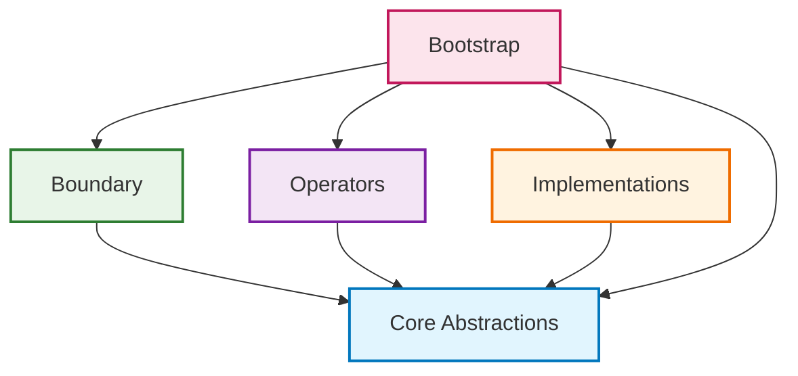
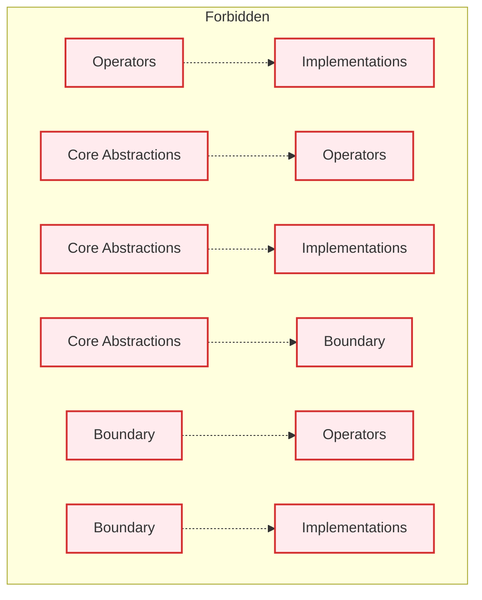

# Clear Layer Separation Principle

## Intent
Maintain strict boundaries between the 5 ADD layers, ensuring each layer has distinct responsibilities and dependencies flow in only one direction.

## The Principle

> **"Each layer should have a single, well-defined responsibility and should only depend on abstractions from layers below it."**

Layer separation ensures that changes in one layer don't cascade throughout the system, making the architecture maintainable and flexible.

## ADD Layer Responsibilities

### 1. **Boundary Layer**
**Responsibility**: Handle external communication and data contracts

```typescript
// ✅ Boundary layer responsibilities
export interface CreateUserDto {
  email: string;
  fullName: string;
  birthDate: string;
}

export interface UserResponseDto {
  id: string;
  email: string;
  fullName: string;
  isActive: boolean;
  createdAt: string;
}

export class UserController {
  constructor(private readonly userOperator: UserOperator) {}

  @Post('/users')
  async createUser(@Body() dto: CreateUserDto): Promise<UserResponseDto> {
    return await this.userOperator.createUser(dto);
  }

  @Get('/users/:id')
  async getUser(@Param('id') id: string): Promise<UserResponseDto> {
    const user = await this.userOperator.getUserById(id);
    if (!user) {
      throw new NotFoundException('User not found');
    }
    return user;
  }
}

// ❌ Boundary layer doing business logic
export class UserController {
  @Post('/users')
  async createUser(@Body() dto: CreateUserDto): Promise<UserResponseDto> {
    // Business validation in boundary layer
    if (!dto.email.includes('@')) {
      throw new BadRequestException('Invalid email');
    }

    // Business rules in boundary layer
    if (dto.fullName.length < 2) {
      throw new BadRequestException('Name too short');
    }

    // Direct database access in boundary layer
    const existingUser = await this.userRepository.findByEmail(dto.email);
    if (existingUser) {
      throw new ConflictException('User already exists');
    }

    // Entity creation in boundary layer
    const user = new User(
      UserId.generate(),
      new Email(dto.email),
      FullName.fromString(dto.fullName),
      new Date(dto.birthDate),
      true,
      new Date()
    );

    await this.userRepository.save(user);
    return this.mapToDto(user);
  }
}
```

### 2. **Core Abstractions Layer**
**Responsibility**: Define business concepts and contracts

```typescript
// ✅ Core Abstractions responsibilities
export class User {
  constructor(
    public readonly id: UserId,
    public readonly email: Email,
    public readonly fullName: FullName,
    public readonly birthDate: Date,
    public readonly isActive: boolean,
    public readonly createdAt: Date
  ) {
    this.validateBusinessRules();
  }

  static create(dto: CreateUserDto): User {
    return new User(
      UserId.generate(),
      new Email(dto.email),
      FullName.fromString(dto.fullName),
      new Date(dto.birthDate),
      true,
      new Date()
    );
  }

  deactivate(): User {
    return new User(
      this.id,
      this.email,
      this.fullName,
      this.birthDate,
      false,
      this.createdAt
    );
  }

  private validateBusinessRules(): void {
    const age = this.calculateAge();
    if (age < 13) {
      throw new Error('User must be at least 13 years old');
    }
  }

  private calculateAge(): number {
    const today = new Date();
    const birthYear = this.birthDate.getFullYear();
    const currentYear = today.getFullYear();
    return currentYear - birthYear;
  }
}

export interface IUserRepository {
  save(user: User): Promise<void>;
  findById(id: UserId): Promise<User | null>;
  findByEmail(email: Email): Promise<User | null>;
  findActiveUsers(): Promise<User[]>;
}

// ❌ Core Abstractions doing infrastructure work
export class User {
  constructor(/* ... */) {}

  // Database operations in entity
  async save(): Promise<void> {
    const query = 'INSERT INTO users (id, email) VALUES ($1, $2)';
    await database.query(query, [this.id.value, this.email.value]);
  }

  // HTTP operations in entity
  async sendWelcomeEmail(): Promise<void> {
    await fetch('https://email-service.com/send', {
      method: 'POST',
      body: JSON.stringify({ email: this.email.value })
    });
  }

  // File system operations in entity
  async saveToFile(): Promise<void> {
    await fs.writeFile(`users/${this.id.value}.json`, JSON.stringify(this));
  }
}
```

### 3. **Operators Layer**
**Responsibility**: Orchestrate business logic and coordinate between abstractions

```typescript
// ✅ Operators layer responsibilities
export class UserOperator {
  constructor(
    private readonly userRepository: IUserRepository,
    private readonly emailService: IEmailService,
    private readonly eventBus: IEventBus
  ) {}

  async createUser(dto: CreateUserDto): Promise<UserResponseDto> {
    // Business validation
    await this.validateUniqueEmail(dto.email);

    // Business logic orchestration
    const user = User.create(dto);
    await this.userRepository.save(user);

    // Business event emission
    await this.eventBus.emit(new UserCreatedEvent(user.id.value));

    // External service coordination
    await this.emailService.sendWelcomeEmail(user.email, user.fullName.value);

    // Response mapping
    return this.mapToResponseDto(user);
  }

  async deactivateUser(id: string): Promise<UserResponseDto> {
    const user = await this.findUserById(id);
    const deactivatedUser = user.deactivate();

    await this.userRepository.save(deactivatedUser);
    await this.eventBus.emit(new UserDeactivatedEvent(user.id.value));

    return this.mapToResponseDto(deactivatedUser);
  }

  private async validateUniqueEmail(email: string): Promise<void> {
    const existingUser = await this.userRepository.findByEmail(new Email(email));
    if (existingUser) {
      throw new Error('Email already exists');
    }
  }

  private async findUserById(id: string): Promise<User> {
    const user = await this.userRepository.findById(UserId.fromString(id));
    if (!user) {
      throw new Error('User not found');
    }
    return user;
  }

  private mapToResponseDto(user: User): UserResponseDto {
    return {
      id: user.id.value,
      email: user.email.value,
      fullName: user.fullName.value,
      isActive: user.isActive,
      createdAt: user.createdAt.toISOString()
    };
  }
}

// ❌ Operators doing infrastructure implementation
export class UserOperator {
  constructor(private readonly database: Pool) {}

  async createUser(dto: CreateUserDto): Promise<UserResponseDto> {
    // SQL queries in operator
    const query = `
      INSERT INTO users (id, email, full_name, birth_date, is_active, created_at)
      VALUES ($1, $2, $3, $4, $5, $6)
    `;

    const userId = uuidv4();
    await this.database.query(query, [
      userId,
      dto.email,
      dto.fullName,
      dto.birthDate,
      true,
      new Date()
    ]);

    // Direct SMTP operations in operator
    const transporter = nodemailer.createTransporter({
      host: 'smtp.gmail.com',
      port: 587,
      auth: {
        user: process.env.EMAIL_USER,
        pass: process.env.EMAIL_PASS
      }
    });

    await transporter.sendMail({
      from: 'noreply@company.com',
      to: dto.email,
      subject: 'Welcome!',
      html: '<h1>Welcome to our platform!</h1>'
    });

    return {
      id: userId,
      email: dto.email,
      fullName: dto.fullName,
      isActive: true,
      createdAt: new Date().toISOString()
    };
  }
}
```

### 4. **Implementations Layer**
**Responsibility**: Provide concrete implementations of technical concerns

```typescript
// ✅ Implementations layer responsibilities
export class PostgresUserRepository implements IUserRepository {
  constructor(private readonly db: Pool) {}

  async save(user: User): Promise<void> {
    const query = `
      INSERT INTO users (id, email, full_name, birth_date, is_active, created_at)
      VALUES ($1, $2, $3, $4, $5, $6)
      ON CONFLICT (id) DO UPDATE SET
        email = EXCLUDED.email,
        full_name = EXCLUDED.full_name,
        is_active = EXCLUDED.is_active
    `;

    await this.db.query(query, [
      user.id.value,
      user.email.value,
      user.fullName.value,
      user.birthDate,
      user.isActive,
      user.createdAt
    ]);
  }

  async findById(id: UserId): Promise<User | null> {
    const query = 'SELECT * FROM users WHERE id = $1';
    const result = await this.db.query(query, [id.value]);

    if (result.rows.length === 0) {
      return null;
    }

    return this.mapRowToUser(result.rows[0]);
  }

  private mapRowToUser(row: any): User {
    return new User(
      UserId.fromString(row.id),
      new Email(row.email),
      FullName.fromString(row.full_name),
      new Date(row.birth_date),
      row.is_active,
      new Date(row.created_at)
    );
  }
}

export class SmtpEmailService implements IEmailService {
  constructor(private readonly transporter: nodemailer.Transporter) {}

  async sendWelcomeEmail(email: Email, userName: string): Promise<void> {
    await this.transporter.sendMail({
      from: 'noreply@company.com',
      to: email.value,
      subject: 'Welcome to our platform!',
      html: `<h1>Welcome ${userName}!</h1>`
    });
  }

  async sendPasswordResetEmail(email: Email, resetToken: string): Promise<void> {
    const resetUrl = `https://app.com/reset-password?token=${resetToken}`;

    await this.transporter.sendMail({
      from: 'noreply@company.com',
      to: email.value,
      subject: 'Password Reset',
      html: `<p>Click <a href="${resetUrl}">here</a> to reset your password.</p>`
    });
  }
}

// ❌ Implementations doing business logic
export class PostgresUserRepository implements IUserRepository {
  async save(user: User): Promise<void> {
    // Business validation in implementation layer
    if (user.email.value.includes('test')) {
      throw new Error('Test emails not allowed in production');
    }

    // Business rules in implementation layer
    const age = this.calculateAge(user.birthDate);
    if (age < 13) {
      throw new Error('User too young');
    }

    // Business logic in implementation layer
    const discount = this.calculateWelcomeDiscount(user);
    const updatedUser = user.applyDiscount(discount);

    await this.db.query(/* save user */);

    // Business event emission in implementation layer
    await this.eventBus.emit(new UserCreatedEvent(user.id.value));
  }
}
```

### 5. **Bootstrap Layer**
**Responsibility**: Configure and wire up all dependencies

```typescript
// ✅ Bootstrap layer responsibilities
export class DIContainer {
  static configure(): Container {
    const container = new Container();

    // Infrastructure configuration
    this.configureDatabase(container);
    this.configureExternalServices(container);

    // Repository registration
    container.bind<IUserRepository>('IUserRepository')
      .to(PostgresUserRepository);

    container.bind<IEmailService>('IEmailService')
      .to(SmtpEmailService);

    container.bind<IEventBus>('IEventBus')
      .to(InMemoryEventBus);

    // Operator registration
    container.bind<UserOperator>('UserOperator')
      .toDynamicValue((context) => {
        return new UserOperator(
          context.container.get<IUserRepository>('IUserRepository'),
          context.container.get<IEmailService>('IEmailService'),
          context.container.get<IEventBus>('IEventBus')
        );
      });

    return container;
  }

  private static configureDatabase(container: Container): void {
    const dbConfig = {
      host: process.env.DB_HOST,
      port: parseInt(process.env.DB_PORT || '5432'),
      database: process.env.DB_NAME,
      user: process.env.DB_USER,
      password: process.env.DB_PASSWORD
    };

    container.bind<Pool>('DatabasePool')
      .toConstantValue(new Pool(dbConfig));
  }

  private static configureExternalServices(container: Container): void {
    const emailTransporter = nodemailer.createTransporter({
      host: process.env.SMTP_HOST,
      port: parseInt(process.env.SMTP_PORT || '587'),
      auth: {
        user: process.env.SMTP_USER,
        pass: process.env.SMTP_PASS
      }
    });

    container.bind<nodemailer.Transporter>('EmailTransporter')
      .toConstantValue(emailTransporter);
  }
}

// ❌ Bootstrap doing business logic
export class DIContainer {
  static configure(): Container {
    const container = new Container();

    container.bind<UserOperator>('UserOperator')
      .toDynamicValue((context) => {
        const userOperator = new UserOperator(/* dependencies */);

        // Business logic in bootstrap
        userOperator.setValidationRules([
          new EmailValidationRule(),
          new AgeValidationRule()
        ]);

        // Business configuration in bootstrap
        userOperator.configureWelcomeBonus(100);
        userOperator.setDiscountStrategy(new VipDiscountStrategy());

        return userOperator;
      });

    return container;
  }
}
```

## Dependency Flow Rules

### ✅ Allowed Dependencies



### ❌ Forbidden Dependencies



## Common Layer Violations

### 1. **Business Logic in Boundary Layer**

```typescript
// ❌ Controller doing business logic
export class UserController {
  @Post('/users')
  async createUser(@Body() dto: CreateUserDto): Promise<UserResponseDto> {
    // Validation logic belongs in Operators
    if (!dto.email.includes('@')) {
      throw new BadRequestException('Invalid email');
    }

    // Business rules belong in Operators
    const age = this.calculateAge(new Date(dto.birthDate));
    if (age < 13) {
      throw new BadRequestException('Too young');
    }

    // Data access belongs in Implementations
    const existingUser = await this.userRepository.findByEmail(dto.email);
    if (existingUser) {
      throw new ConflictException('User exists');
    }

    // Entity creation belongs in Core Abstractions
    const user = new User(/* ... */);
    await this.userRepository.save(user);

    return this.mapToDto(user);
  }
}

// ✅ Controller focusing on HTTP concerns
export class UserController {
  constructor(private readonly userOperator: UserOperator) {}

  @Post('/users')
  async createUser(@Body() dto: CreateUserDto): Promise<UserResponseDto> {
    try {
      return await this.userOperator.createUser(dto);
    } catch (error) {
      if (error instanceof ValidationError) {
        throw new BadRequestException(error.message);
      }
      if (error instanceof DuplicateError) {
        throw new ConflictException(error.message);
      }
      throw new InternalServerErrorException('Internal error');
    }
  }
}
```

### 2. **Infrastructure Details in Core Abstractions**

```typescript
// ❌ Entity knowing about database
export class User {
  constructor(/* ... */) {}

  async save(): Promise<void> {
    const query = 'UPDATE users SET email = $1 WHERE id = $2';
    await database.query(query, [this.email.value, this.id.value]);
  }

  static async findByEmail(email: string): Promise<User | null> {
    const query = 'SELECT * FROM users WHERE email = $1';
    const result = await database.query(query, [email]);
    return result.rows.length > 0 ? new User(/* ... */) : null;
  }
}

// ✅ Entity focusing on business concepts
export class User {
  constructor(
    public readonly id: UserId,
    public readonly email: Email,
    public readonly fullName: FullName,
    public readonly birthDate: Date,
    public readonly isActive: boolean,
    public readonly createdAt: Date
  ) {}

  updateEmail(newEmail: Email): User {
    return new User(
      this.id,
      newEmail,
      this.fullName,
      this.birthDate,
      this.isActive,
      this.createdAt
    );
  }

  deactivate(): User {
    return new User(
      this.id,
      this.email,
      this.fullName,
      this.birthDate,
      false,
      this.createdAt
    );
  }
}
```

### 3. **Operators Depending on Implementations**

```typescript
// ❌ Operator importing concrete implementation
import { PostgresUserRepository } from '../implementations/repositories/postgres-user.repository';

export class UserOperator {
  constructor(
    private readonly userRepository: PostgresUserRepository  // ← Concrete dependency
  ) {}

  async createUser(dto: CreateUserDto): Promise<UserResponseDto> {
    // Using implementation-specific methods
    await this.userRepository.executeRawQuery('TRUNCATE users_temp');
    const user = User.create(dto);
    await this.userRepository.saveWithTransaction(user);
    return this.mapToResponseDto(user);
  }
}

// ✅ Operator depending only on abstraction
import { IUserRepository } from '../core-abstractions/ports/user.repository';

export class UserOperator {
  constructor(
    private readonly userRepository: IUserRepository  // ← Abstraction
  ) {}

  async createUser(dto: CreateUserDto): Promise<UserResponseDto> {
    await this.validateUniqueEmail(dto.email);
    const user = User.create(dto);
    await this.userRepository.save(user);
    return this.mapToResponseDto(user);
  }
}
```

## Testing Layer Separation

### Unit Tests Should Respect Boundaries

```typescript
// ✅ Test each layer in isolation
describe('UserOperator', () => {
  let userOperator: UserOperator;
  let mockUserRepository: jest.Mocked<IUserRepository>;
  let mockEmailService: jest.Mocked<IEmailService>;

  beforeEach(() => {
    // Mock abstractions, not implementations
    mockUserRepository = {
      save: jest.fn(),
      findById: jest.fn(),
      findByEmail: jest.fn(),
      findActiveUsers: jest.fn()
    };

    mockEmailService = {
      sendWelcomeEmail: jest.fn(),
      sendPasswordResetEmail: jest.fn()
    };

    userOperator = new UserOperator(mockUserRepository, mockEmailService);
  });

  it('should create user when email is unique', async () => {
    // Arrange
    mockUserRepository.findByEmail.mockResolvedValue(null);

    // Act
    const result = await userOperator.createUser(validUserDto);

    // Assert - test business logic, not implementation details
    expect(result.email).toBe(validUserDto.email);
    expect(mockUserRepository.save).toHaveBeenCalledTimes(1);
    expect(mockEmailService.sendWelcomeEmail).toHaveBeenCalledTimes(1);
  });
});

// ❌ Test crossing layer boundaries
describe('UserOperator', () => {
  it('should save user to database', async () => {
    const userOperator = new UserOperator(
      new PostgresUserRepository(realDatabaseConnection),  // ← Real implementation
      new SmtpEmailService(realEmailTransporter)           // ← Real implementation
    );

    const result = await userOperator.createUser(validUserDto);

    // Testing implementation details, not business logic
    const savedUser = await realDatabaseConnection.query('SELECT * FROM users WHERE id = $1', [result.id]);
    expect(savedUser.rows).toHaveLength(1);
  });
});
```

### Integration Tests for Layer Interaction

```typescript
// ✅ Integration tests verify layer coordination
describe('User Creation Integration', () => {
  let app: Application;
  let database: Pool;

  beforeAll(async () => {
    app = await createTestApp();
    database = await createTestDatabase();
  });

  it('should create user through all layers', async () => {
    // Test through boundary layer
    const response = await request(app)
      .post('/users')
      .send(validUserDto)
      .expect(201);

    // Verify business logic worked
    expect(response.body.email).toBe(validUserDto.email);

    // Verify persistence worked
    const savedUser = await database.query('SELECT * FROM users WHERE id = $1', [response.body.id]);
    expect(savedUser.rows).toHaveLength(1);
  });
});
```

## Architecture Testing

### Automated Layer Dependency Validation

```typescript
// Architecture test to enforce layer separation
describe('Architecture Tests', () => {
  it('should not allow operators to import implementations', () => {
    const operatorFiles = glob.sync('src/operators/**/*.ts');

    operatorFiles.forEach(file => {
      const content = fs.readFileSync(file, 'utf8');
      const implementationImports = content.match(/from ['"](.*implementations.*)['"]/g);

      expect(implementationImports).toBeNull();
    });
  });

  it('should not allow core abstractions to import other layers', () => {
    const coreFiles = glob.sync('src/core-abstractions/**/*.ts');

    coreFiles.forEach(file => {
      const content = fs.readFileSync(file, 'utf8');
      const forbiddenImports = content.match(/from ['"](.*(operators|implementations|boundary|bootstrap).*)['"]/g);

      expect(forbiddenImports).toBeNull();
    });
  });

  it('should ensure all operator constructor dependencies are interfaces', () => {
    const operatorFiles = glob.sync('src/operators/**/*.operator.ts');

    operatorFiles.forEach(file => {
      const ast = parseTypeScriptFile(file);
      const constructorParams = getConstructorParameters(ast);

      constructorParams.forEach(param => {
        expect(param.type.startsWith('I')).toBe(true); // Interface naming convention
      });
    });
  });
});
```

## Benefits of Clear Layer Separation

### 1. **Maintainability**
```typescript
// Changes in one layer don't affect others
// Change database from PostgreSQL to MongoDB
export class MongoUserRepository implements IUserRepository {
  // New implementation
  // Operators and other layers unchanged
}
```

### 2. **Testability**
```typescript
// Each layer can be tested in isolation
// Business logic tests don't need database
// Database tests don't need business logic
```

### 3. **Team Productivity**
```typescript
// Teams can work on different layers simultaneously
// Frontend team: Boundary layer
// Backend team: Operators layer
// Infrastructure team: Implementations layer
```

### 4. **Technology Flexibility**
```typescript
// Easy to change technologies in implementation layer
// Business logic remains stable
// External contracts remain stable
```

## Best Practices

1. **Clear File Organization**: Organize files by layer, not by feature
2. **Naming Conventions**: Use consistent naming to indicate layer membership
3. **Import Rules**: Establish and enforce import restrictions
4. **Interface Design**: Design interfaces that don't leak implementation details
5. **Architecture Tests**: Use automated tests to enforce layer boundaries
6. **Code Reviews**: Review for layer violations during development
7. **Documentation**: Document layer responsibilities and boundaries
8. **Training**: Ensure team understands layer separation principles

Clear layer separation is fundamental to ADD's success, enabling all other benefits like testability, maintainability, and flexibility.