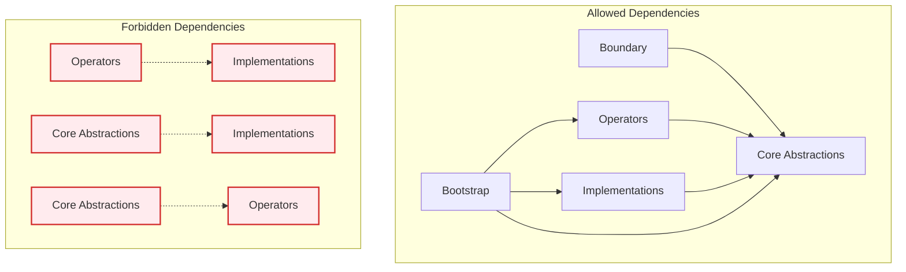

# Dependency Inversion Principle (DIP) in ADD

## Intent
Ensure that high-level business logic modules do not depend on low-level technical implementation details. Instead, both should depend on abstractions (interfaces).

## The Principle

> **"High-level modules should not depend on low-level modules. Both should depend on abstractions."**
>
> **"Abstractions should not depend on details. Details should depend on abstractions."**

In ADD context: Business logic (Operators) should never directly depend on technical implementations (Implementations). Both should depend on interfaces (Ports in Core Abstractions).

## ADD Implementation

### ✅ Correct DIP Implementation

```typescript
// Core Abstractions - Define what business needs
export interface IUserRepository {
  save(user: User): Promise<void>;
  findById(id: UserId): Promise<User | null>;
  findByEmail(email: Email): Promise<User | null>;
}

export interface IEmailService {
  sendWelcomeEmail(email: Email, userName: string): Promise<void>;
}

// Operators - Business logic depends only on abstractions
export class UserOperator {
  constructor(
    private readonly userRepository: IUserRepository,  // ← Abstraction
    private readonly emailService: IEmailService       // ← Abstraction
  ) {}

  async registerUser(dto: CreateUserDto): Promise<UserResponseDto> {
    // Business logic using abstractions
    const existingUser = await this.userRepository.findByEmail(new Email(dto.email));
    if (existingUser) {
      throw new Error('User already exists');
    }

    const user = User.create(dto);
    await this.userRepository.save(user);
    await this.emailService.sendWelcomeEmail(user.email, user.fullName.value);

    return this.mapToResponseDto(user);
  }
}

// Implementations - Technical details implement abstractions
export class PostgresUserRepository implements IUserRepository {
  constructor(private readonly db: Pool) {}

  async save(user: User): Promise<void> {
    const query = 'INSERT INTO users (id, email, full_name) VALUES ($1, $2, $3)';
    await this.db.query(query, [user.id.value, user.email.value, user.fullName.value]);
  }

  async findById(id: UserId): Promise<User | null> {
    const query = 'SELECT * FROM users WHERE id = $1';
    const result = await this.db.query(query, [id.value]);
    return result.rows.length > 0 ? this.mapToUser(result.rows[0]) : null;
  }
}

export class SmtpEmailService implements IEmailService {
  constructor(private readonly smtpClient: SMTPClient) {}

  async sendWelcomeEmail(email: Email, userName: string): Promise<void> {
    await this.smtpClient.send({
      to: email.value,
      subject: 'Welcome!',
      html: `<h1>Welcome ${userName}!</h1>`
    });
  }
}
```

### ❌ DIP Violation Examples

```typescript
// DON'T: Operator depending directly on implementation
export class UserOperator {
  constructor(
    private readonly postgresDb: Pool,           // ← Direct dependency on technology
    private readonly smtpClient: SMTPClient      // ← Direct dependency on technology
  ) {}

  async registerUser(dto: CreateUserDto): Promise<UserResponseDto> {
    // Business logic mixed with technical details
    const query = 'SELECT * FROM users WHERE email = $1';
    const result = await this.postgresDb.query(query, [dto.email]);

    if (result.rows.length > 0) {
      throw new Error('User already exists');
    }

    // More database-specific code in business logic...
  }
}

// DON'T: Abstraction depending on implementation details
export interface IUserRepository {
  executeQuery(sql: string): Promise<any>;      // ← SQL leakage
  getConnection(): Pool;                        // ← Database-specific
}
```

## Benefits in ADD Architecture

### 1. **Technology Independence**
```typescript
// Same business logic, different implementations
const developmentContainer = {
  userRepository: new InMemoryUserRepository(),     // Fast for testing
  emailService: new ConsoleEmailService()          // No external dependencies
};

const productionContainer = {
  userRepository: new PostgresUserRepository(pool), // Production database
  emailService: new SendGridEmailService(client)   // Production email service
};

// Business logic (UserOperator) works with both configurations
```

### 2. **Easy Testing**
```typescript
describe('UserOperator', () => {
  let userOperator: UserOperator;
  let mockUserRepository: jest.Mocked<IUserRepository>;
  let mockEmailService: jest.Mocked<IEmailService>;

  beforeEach(() => {
    mockUserRepository = {
      save: jest.fn(),
      findById: jest.fn(),
      findByEmail: jest.fn()
    };

    mockEmailService = {
      sendWelcomeEmail: jest.fn()
    };

    userOperator = new UserOperator(mockUserRepository, mockEmailService);
  });

  it('should register new user successfully', async () => {
    // Arrange
    mockUserRepository.findByEmail.mockResolvedValue(null);

    // Act
    const result = await userOperator.registerUser(validUserDto);

    // Assert
    expect(mockUserRepository.save).toHaveBeenCalledTimes(1);
    expect(mockEmailService.sendWelcomeEmail).toHaveBeenCalledTimes(1);
    expect(result.email).toBe(validUserDto.email);
  });
});
```

### 3. **Parallel Development**
```typescript
// Team A: Can develop business logic with mock repositories
export class OrderOperator {
  constructor(
    private readonly orderRepository: IOrderRepository,      // Interface exists
    private readonly paymentService: IPaymentService        // Interface exists
  ) {}

  async processOrder(dto: ProcessOrderDto): Promise<OrderResponseDto> {
    // Business logic development can proceed
    // while Team B works on implementations
  }
}

// Team B: Can develop implementations independently
export class StripePaymentService implements IPaymentService {
  // Implementation details
  // Can be developed in parallel with business logic
}
```

## DIP in ADD Layers

### Layer Dependency Rules



### 1. **Boundary Layer**
```typescript
// ✅ Boundary depends on Core Abstractions only
export class UserController {
  constructor(
    private readonly userOperator: UserOperator  // ← Core Abstractions
  ) {}

  @Post('/users')
  async createUser(@Body() dto: CreateUserDto): Promise<UserResponseDto> {
    return await this.userOperator.registerUser(dto);
  }
}
```

### 2. **Core Abstractions Layer**
```typescript
// ✅ Entities and Ports are independent
export class User {
  // No dependencies on other layers
  constructor(
    public readonly id: UserId,
    public readonly email: Email,
    public readonly fullName: FullName
  ) {}
}

export interface IUserRepository {
  // No dependencies on implementations
  save(user: User): Promise<void>;
  findById(id: UserId): Promise<User | null>;
}
```

### 3. **Operators Layer**
```typescript
// ✅ Operators depend only on Core Abstractions
export class UserOperator {
  constructor(
    private readonly userRepository: IUserRepository,  // ← Port (abstraction)
    private readonly eventBus: IEventBus              // ← Port (abstraction)
  ) {}

  // Business logic using only abstractions
}
```

### 4. **Implementations Layer**
```typescript
// ✅ Implementations depend on Core Abstractions
export class PostgresUserRepository implements IUserRepository {
  constructor(private readonly db: Pool) {}

  // Technical implementation of business interface
  async save(user: User): Promise<void> {
    // Database-specific code
  }
}
```

### 5. **Bootstrap Layer**
```typescript
// ✅ Bootstrap wires everything together
export class DIContainer {
  static configure(): Container {
    const container = new Container();

    // Register implementations
    container.bind<IUserRepository>('IUserRepository')
      .to(PostgresUserRepository);

    container.bind<IEmailService>('IEmailService')
      .to(SmtpEmailService);

    // Register operators (depend on abstractions)
    container.bind<UserOperator>('UserOperator')
      .toDynamicValue((context) => {
        return new UserOperator(
          context.container.get<IUserRepository>('IUserRepository'),
          context.container.get<IEmailService>('IEmailService')
        );
      });

    return container;
  }
}
```

## Common DIP Violations in ADD

### 1. **Leaky Abstractions**
```typescript
// ❌ DON'T: Expose implementation details in interfaces
export interface IUserRepository {
  getDbConnection(): Pool;                    // Database leakage
  executeQuery(sql: string): Promise<any>;   // SQL leakage
  getTableName(): string;                     // Database structure leakage
}

// ✅ DO: Keep interfaces business-focused
export interface IUserRepository {
  save(user: User): Promise<void>;
  findById(id: UserId): Promise<User | null>;
  findActiveUsers(): Promise<User[]>;
}
```

### 2. **Direct Implementation Dependencies**
```typescript
// ❌ DON'T: Import implementation classes in operators
import { PostgresUserRepository } from '../implementations/postgres-user.repository';

export class UserOperator {
  constructor(
    private readonly userRepository: PostgresUserRepository  // ← Direct dependency
  ) {}
}

// ✅ DO: Depend only on abstractions
import { IUserRepository } from '../core-abstractions/ports/user.repository';

export class UserOperator {
  constructor(
    private readonly userRepository: IUserRepository  // ← Abstraction
  ) {}
}
```

### 3. **Technology Bleeding into Business Logic**
```typescript
// ❌ DON'T: Mix business logic with technical concerns
export class UserOperator {
  async registerUser(dto: CreateUserDto): Promise<UserResponseDto> {
    // Database transaction logic in business layer
    const transaction = await this.db.beginTransaction();

    try {
      const query = 'INSERT INTO users...';  // SQL in business logic
      await transaction.query(query, values);

      // HTTP client usage in business logic
      await this.httpClient.post('https://email-service.com/send', emailData);

      await transaction.commit();
    } catch (error) {
      await transaction.rollback();
      throw error;
    }
  }
}

// ✅ DO: Keep business logic pure
export class UserOperator {
  constructor(
    private readonly userRepository: IUserRepository,
    private readonly emailService: IEmailService
  ) {}

  async registerUser(dto: CreateUserDto): Promise<UserResponseDto> {
    // Pure business logic
    const user = User.create(dto);
    await this.userRepository.save(user);
    await this.emailService.sendWelcomeEmail(user.email, user.fullName.value);
    return this.mapToResponseDto(user);
  }
}
```

## DIP Enforcement Strategies

### 1. **Dependency Injection**
```typescript
// Constructor injection ensures dependencies are abstractions
export class UserOperator {
  constructor(
    private readonly userRepository: IUserRepository,  // Injected abstraction
    private readonly emailService: IEmailService       // Injected abstraction
  ) {}
}
```

### 2. **Interface Segregation**
```typescript
// Smaller, focused interfaces prevent leaky abstractions
export interface IUserReader {
  findById(id: UserId): Promise<User | null>;
  findByEmail(email: Email): Promise<User | null>;
}

export interface IUserWriter {
  save(user: User): Promise<void>;
  delete(id: UserId): Promise<void>;
}

export interface IUserRepository extends IUserReader, IUserWriter {}
```

### 3. **Factory Pattern for Complex Creation**
```typescript
// Factory abstracts complex object creation
export interface IUserFactory {
  createUser(dto: CreateUserDto): User;
  createUserFromData(data: UserData): User;
}

export class UserOperator {
  constructor(
    private readonly userFactory: IUserFactory,    // ← Abstraction for creation
    private readonly userRepository: IUserRepository
  ) {}

  async registerUser(dto: CreateUserDto): Promise<UserResponseDto> {
    const user = this.userFactory.createUser(dto);  // Using abstraction
    await this.userRepository.save(user);
    return this.mapToResponseDto(user);
  }
}
```

## Best Practices

1. **Define Interfaces First**: Write business interfaces before implementations
2. **Business-Focused Naming**: Interface methods should express business intent
3. **Avoid Technology Leakage**: No database, HTTP, or framework concepts in interfaces
4. **Single Responsibility**: Each interface should have one clear purpose
5. **Stable Interfaces**: Minimize changes to established interfaces
6. **Dependency Injection**: Use DI containers to wire dependencies
7. **Testing**: Mock interfaces easily for unit testing
8. **Documentation**: Document interface contracts and expectations

## Measuring DIP Compliance

```typescript
// Good metrics for DIP compliance:
// 1. Zero direct imports from Implementations layer in Operators
// 2. All dependencies in constructors are interfaces
// 3. No concrete classes in Core Abstractions
// 4. High test coverage using mocked interfaces

// Architecture test example
describe('DIP Compliance', () => {
  it('should not have operators depending on implementations', () => {
    const operatorFiles = getAllFilesInLayer('operators');
    const implementationImports = findImportsFromLayer(operatorFiles, 'implementations');
    expect(implementationImports).toHaveLength(0);
  });

  it('should have all constructor dependencies as interfaces', () => {
    const operators = getAllOperators();
    operators.forEach(operator => {
      const dependencies = getConstructorDependencies(operator);
      dependencies.forEach(dep => {
        expect(isInterface(dep.type)).toBe(true);
      });
    });
  });
});
```

The Dependency Inversion Principle is the foundation of ADD architecture, enabling all other benefits like testability, flexibility, and technology independence.