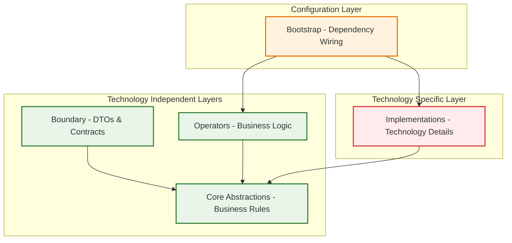

# Technology Independence Principle

## Intent
Enable business logic to operate independently of specific technologies, frameworks, databases, or external services, making the system adaptable to technological changes without affecting core business rules.

## The Principle

> **"Business logic should be completely unaware of the specific technologies used to implement infrastructure concerns."**

Technology Independence means your business rules work the same whether you use PostgreSQL or MongoDB, Express or Fastify, AWS or Azure, SendGrid or Mailgun.

## Why Technology Independence Matters

### 1. **Technology Evolution**
Technologies change rapidly. Your business logic shouldn't become obsolete when:
- New database technologies emerge
- Cloud providers change offerings
- Framework paradigms shift
- Third-party services evolve

### 2. **Risk Mitigation**
- **Vendor Lock-in**: Avoid being trapped by specific technology choices
- **Technology Debt**: Prevent coupling to deprecated technologies
- **Licensing Changes**: Adapt when licensing terms change
- **Performance Issues**: Switch implementations when performance degrades

### 3. **Business Continuity**
- **Team Changes**: New developers aren't locked into specific technology expertise
- **Environment Flexibility**: Run in different environments without code changes
- **Testing Efficiency**: Use lightweight implementations for testing

## ADD Implementation Strategy

### Layer Responsibility for Technology Independence



### ✅ Technology Independent Business Logic

```typescript
// Core Abstractions - Pure business concepts
export class Order {
  constructor(
    public readonly id: OrderId,
    public readonly customerId: CustomerId,
    public readonly items: OrderItem[],
    public readonly total: Money,
    public readonly status: OrderStatus,
    public readonly createdAt: Date
  ) {}

  // Pure business logic - no technology dependencies
  canBeCancelled(): boolean {
    return this.status === OrderStatus.PENDING || this.status === OrderStatus.CONFIRMED;
  }

  calculateDiscount(customer: Customer): Money {
    // Business rule logic independent of technology
    if (customer.isVip() && this.total.value > 1000) {
      return this.total.multiply(0.1); // 10% VIP discount
    }
    return Money.zero();
  }

  addItem(item: OrderItem): Order {
    const newItems = [...this.items, item];
    const newTotal = this.calculateTotal(newItems);

    return new Order(
      this.id,
      this.customerId,
      newItems,
      newTotal,
      this.status,
      this.createdAt
    );
  }
}

// Business ports - define what we need, not how to implement
export interface IOrderRepository {
  save(order: Order): Promise<void>;
  findById(id: OrderId): Promise<Order | null>;
  findByCustomerId(customerId: CustomerId): Promise<Order[]>;
  findPendingOrders(): Promise<Order[]>;
}

export interface IPaymentService {
  processPayment(customerId: CustomerId, amount: Money): Promise<PaymentResult>;
  refundPayment(paymentId: string, amount: Money): Promise<RefundResult>;
}

export interface INotificationService {
  sendOrderConfirmation(customerId: CustomerId, order: Order): Promise<void>;
  sendOrderCancellation(customerId: CustomerId, order: Order): Promise<void>;
}

// Operators - Pure business orchestration
export class OrderOperator {
  constructor(
    private readonly orderRepository: IOrderRepository,
    private readonly paymentService: IPaymentService,
    private readonly notificationService: INotificationService,
    private readonly customerRepository: ICustomerRepository
  ) {}

  async createOrder(dto: CreateOrderDto): Promise<OrderResponseDto> {
    // Business logic without technology concerns
    const customer = await this.customerRepository.findById(
      CustomerId.fromString(dto.customerId)
    );

    if (!customer) {
      throw new Error('Customer not found');
    }

    // Create order using business logic
    const order = Order.create(dto);
    const discount = order.calculateDiscount(customer);
    const finalOrder = order.applyDiscount(discount);

    // Process payment using abstraction
    const paymentResult = await this.paymentService.processPayment(
      customer.id,
      finalOrder.total
    );

    if (!paymentResult.success) {
      throw new Error('Payment failed');
    }

    // Save using abstraction
    await this.orderRepository.save(finalOrder);

    // Notify using abstraction
    await this.notificationService.sendOrderConfirmation(customer.id, finalOrder);

    return this.mapToResponseDto(finalOrder);
  }
}
```

### 🔄 Multiple Technology Implementations

```typescript
// PostgreSQL Implementation
export class PostgresOrderRepository implements IOrderRepository {
  constructor(private readonly db: Pool) {}

  async save(order: Order): Promise<void> {
    const query = `
      INSERT INTO orders (id, customer_id, total, status, created_at)
      VALUES ($1, $2, $3, $4, $5)
      ON CONFLICT (id) DO UPDATE SET
        total = EXCLUDED.total,
        status = EXCLUDED.status
    `;

    await this.db.query(query, [
      order.id.value,
      order.customerId.value,
      order.total.value,
      order.status,
      order.createdAt
    ]);
  }

  async findById(id: OrderId): Promise<Order | null> {
    const query = 'SELECT * FROM orders WHERE id = $1';
    const result = await this.db.query(query, [id.value]);
    return result.rows.length > 0 ? this.mapToOrder(result.rows[0]) : null;
  }
}

// MongoDB Implementation
export class MongoOrderRepository implements IOrderRepository {
  constructor(private readonly collection: Collection<OrderDocument>) {}

  async save(order: Order): Promise<void> {
    const document = this.mapToDocument(order);

    await this.collection.replaceOne(
      { _id: order.id.value },
      document,
      { upsert: true }
    );
  }

  async findById(id: OrderId): Promise<Order | null> {
    const document = await this.collection.findOne({ _id: id.value });
    return document ? this.mapToOrder(document) : null;
  }
}

// In-Memory Implementation (for testing)
export class InMemoryOrderRepository implements IOrderRepository {
  private orders = new Map<string, Order>();

  async save(order: Order): Promise<void> {
    this.orders.set(order.id.value, order);
  }

  async findById(id: OrderId): Promise<Order | null> {
    return this.orders.get(id.value) || null;
  }

  async findByCustomerId(customerId: CustomerId): Promise<Order[]> {
    return Array.from(this.orders.values())
      .filter(order => order.customerId.equals(customerId));
  }

  async findPendingOrders(): Promise<Order[]> {
    return Array.from(this.orders.values())
      .filter(order => order.status === OrderStatus.PENDING);
  }
}
```

### 🔄 Payment Service Implementations

```typescript
// Stripe Implementation
export class StripePaymentService implements IPaymentService {
  constructor(private readonly stripeClient: Stripe) {}

  async processPayment(customerId: CustomerId, amount: Money): Promise<PaymentResult> {
    try {
      const charge = await this.stripeClient.charges.create({
        amount: amount.cents, // Stripe uses cents
        currency: amount.currency.toLowerCase(),
        customer: customerId.value,
        description: 'Order payment'
      });

      return PaymentResult.success(charge.id, amount);
    } catch (error) {
      return PaymentResult.failure(error.message);
    }
  }

  async refundPayment(paymentId: string, amount: Money): Promise<RefundResult> {
    try {
      const refund = await this.stripeClient.refunds.create({
        charge: paymentId,
        amount: amount.cents
      });

      return RefundResult.success(refund.id, amount);
    } catch (error) {
      return RefundResult.failure(error.message);
    }
  }
}

// PayPal Implementation
export class PayPalPaymentService implements IPaymentService {
  constructor(private readonly paypalClient: PayPalClient) {}

  async processPayment(customerId: CustomerId, amount: Money): Promise<PaymentResult> {
    try {
      const payment = await this.paypalClient.payment.create({
        intent: 'sale',
        payer: { payment_method: 'paypal' },
        transactions: [{
          amount: {
            total: amount.value.toString(),
            currency: amount.currency
          }
        }]
      });

      return PaymentResult.success(payment.id, amount);
    } catch (error) {
      return PaymentResult.failure(error.message);
    }
  }
}

// Mock Implementation (for testing)
export class MockPaymentService implements IPaymentService {
  private shouldSucceed = true;

  setSuccessMode(succeed: boolean): void {
    this.shouldSucceed = succeed;
  }

  async processPayment(customerId: CustomerId, amount: Money): Promise<PaymentResult> {
    // Simulate processing delay
    await new Promise(resolve => setTimeout(resolve, 100));

    if (this.shouldSucceed) {
      return PaymentResult.success(`mock-payment-${Date.now()}`, amount);
    } else {
      return PaymentResult.failure('Mock payment failure');
    }
  }

  async refundPayment(paymentId: string, amount: Money): Promise<RefundResult> {
    if (this.shouldSucceed) {
      return RefundResult.success(`mock-refund-${Date.now()}`, amount);
    } else {
      return RefundResult.failure('Mock refund failure');
    }
  }
}
```

### ⚙️ Environment-Specific Configuration

```typescript
// Bootstrap - Environment-specific wiring
export class DIContainer {
  static configureForDevelopment(): Container {
    const container = new Container();

    // Fast, lightweight implementations for development
    container.bind<IOrderRepository>('IOrderRepository')
      .to(InMemoryOrderRepository);

    container.bind<IPaymentService>('IPaymentService')
      .to(MockPaymentService);

    container.bind<INotificationService>('INotificationService')
      .to(ConsoleNotificationService); // Logs to console

    this.registerBusinessLogic(container);
    return container;
  }

  static configureForTesting(): Container {
    const container = new Container();

    // Deterministic implementations for testing
    container.bind<IOrderRepository>('IOrderRepository')
      .to(InMemoryOrderRepository);

    container.bind<IPaymentService>('IPaymentService')
      .to(MockPaymentService);

    container.bind<INotificationService>('INotificationService')
      .to(SpyNotificationService); // Captures calls for assertions

    this.registerBusinessLogic(container);
    return container;
  }

  static configureForProduction(): Container {
    const container = new Container();

    // Production implementations
    container.bind<IOrderRepository>('IOrderRepository')
      .toDynamicValue((context) => {
        const dbPool = context.container.get<Pool>('DatabasePool');
        return new PostgresOrderRepository(dbPool);
      });

    container.bind<IPaymentService>('IPaymentService')
      .toDynamicValue((context) => {
        const stripeClient = context.container.get<Stripe>('StripeClient');
        return new StripePaymentService(stripeClient);
      });

    container.bind<INotificationService>('INotificationService')
      .toDynamicValue((context) => {
        const emailService = context.container.get<EmailService>('EmailService');
        return new EmailNotificationService(emailService);
      });

    this.registerBusinessLogic(container);
    return container;
  }

  private static registerBusinessLogic(container: Container): void {
    // Business logic registration is the same across all environments
    container.bind<OrderOperator>('OrderOperator')
      .toDynamicValue((context) => {
        return new OrderOperator(
          context.container.get<IOrderRepository>('IOrderRepository'),
          context.container.get<IPaymentService>('IPaymentService'),
          context.container.get<INotificationService>('INotificationService'),
          context.container.get<ICustomerRepository>('ICustomerRepository')
        );
      });
  }
}
```

## Benefits of Technology Independence

### 1. **Easy Technology Migration**

```typescript
// Migration Example: PostgreSQL → MongoDB
// Business logic remains unchanged
export class OrderOperator {
  // Same constructor, same business logic
  constructor(
    private readonly orderRepository: IOrderRepository, // ← Interface unchanged
    // ... other dependencies
  ) {}

  // Same business methods, no changes needed
  async createOrder(dto: CreateOrderDto): Promise<OrderResponseDto> {
    // Business logic identical regardless of database technology
  }
}

// Only configuration changes
const container = new Container();

// Before: PostgreSQL
// container.bind<IOrderRepository>('IOrderRepository').to(PostgresOrderRepository);

// After: MongoDB
container.bind<IOrderRepository>('IOrderRepository').to(MongoOrderRepository);

// Zero business logic changes required
```

### 2. **Environment Flexibility**

```typescript
// Same application, different environments
const app = createApp();

if (process.env.NODE_ENV === 'development') {
  const container = DIContainer.configureForDevelopment();
  app.useContainer(container);
} else if (process.env.NODE_ENV === 'test') {
  const container = DIContainer.configureForTesting();
  app.useContainer(container);
} else {
  const container = DIContainer.configureForProduction();
  app.useContainer(container);
}

// Business logic works identically in all environments
```

### 3. **A/B Testing Technology**

```typescript
// Test performance between different implementations
export class DatabasePerformanceTest {
  async compareImplementations(): Promise<PerformanceResult> {
    const orderData = generateTestOrders(1000);

    // Test PostgreSQL
    const postgresRepo = new PostgresOrderRepository(postgresPool);
    const postgresTime = await this.measurePerformance(postgresRepo, orderData);

    // Test MongoDB
    const mongoRepo = new MongoOrderRepository(mongoCollection);
    const mongoTime = await this.measurePerformance(mongoRepo, orderData);

    return {
      postgres: postgresTime,
      mongo: mongoTime,
      recommendation: postgresTime < mongoTime ? 'PostgreSQL' : 'MongoDB'
    };
  }

  private async measurePerformance(
    repo: IOrderRepository,
    orders: Order[]
  ): Promise<number> {
    const startTime = Date.now();

    for (const order of orders) {
      await repo.save(order);
    }

    return Date.now() - startTime;
  }
}
```

## Anti-Patterns: Technology Coupling

### ❌ Database Technology Leakage

```typescript
// DON'T: Expose database concepts in business logic
export class OrderOperator {
  async createOrder(dto: CreateOrderDto): Promise<OrderResponseDto> {
    // SQL logic in business layer
    const transaction = await this.db.beginTransaction();

    try {
      const query = `
        INSERT INTO orders (id, customer_id, total)
        VALUES ($1, $2, $3)
        RETURNING *
      `;

      const result = await transaction.query(query, [
        dto.id,
        dto.customerId,
        dto.total
      ]);

      await transaction.commit();
      return this.mapFromDbRow(result.rows[0]);
    } catch (error) {
      await transaction.rollback();
      throw error;
    }
  }
}

// DO: Keep business logic technology-agnostic
export class OrderOperator {
  constructor(
    private readonly orderRepository: IOrderRepository,
    private readonly unitOfWork: IUnitOfWork
  ) {}

  async createOrder(dto: CreateOrderDto): Promise<OrderResponseDto> {
    const order = Order.create(dto);

    await this.unitOfWork.execute(async () => {
      await this.orderRepository.save(order);
      // Other business operations
    });

    return this.mapToResponseDto(order);
  }
}
```

### ❌ Framework Dependencies in Business Logic

```typescript
// DON'T: Couple business logic to specific frameworks
import { Request, Response } from 'express';
import { Controller, Post } from '@nestjs/common';

export class OrderOperator {
  // Express-specific dependencies
  async createOrder(req: Request, res: Response): Promise<void> {
    const dto = req.body as CreateOrderDto;

    // Business logic mixed with HTTP concerns
    try {
      const order = await this.processOrder(dto);
      res.status(201).json(order);
    } catch (error) {
      res.status(400).json({ error: error.message });
    }
  }
}

// DO: Keep business logic framework-agnostic
export class OrderOperator {
  async createOrder(dto: CreateOrderDto): Promise<OrderResponseDto> {
    // Pure business logic - no framework dependencies
    const order = Order.create(dto);
    await this.orderRepository.save(order);
    return this.mapToResponseDto(order);
  }
}

// Framework-specific concerns in boundary layer
@Controller('orders')
export class OrderController {
  constructor(private readonly orderOperator: OrderOperator) {}

  @Post()
  async createOrder(@Body() dto: CreateOrderDto): Promise<OrderResponseDto> {
    return await this.orderOperator.createOrder(dto);
  }
}
```

### ❌ Cloud Provider Lock-in

```typescript
// DON'T: Couple to specific cloud services
import { S3 } from 'aws-sdk';
import { Storage } from '@google-cloud/storage';

export class DocumentOperator {
  constructor(
    private readonly s3Client: S3,  // AWS-specific
    private readonly gcsClient: Storage  // GCP-specific
  ) {}

  async storeDocument(document: Document): Promise<void> {
    // Cloud-specific logic in business layer
    if (process.env.CLOUD_PROVIDER === 'aws') {
      await this.s3Client.upload({
        Bucket: 'my-bucket',
        Key: document.id,
        Body: document.content
      }).promise();
    } else {
      await this.gcsClient.bucket('my-bucket')
        .file(document.id)
        .save(document.content);
    }
  }
}

// DO: Abstract cloud storage
export interface IDocumentStorage {
  store(document: Document): Promise<void>;
  retrieve(documentId: string): Promise<Document | null>;
  delete(documentId: string): Promise<void>;
}

export class DocumentOperator {
  constructor(
    private readonly documentStorage: IDocumentStorage  // Cloud-agnostic
  ) {}

  async storeDocument(document: Document): Promise<void> {
    // Business logic independent of cloud provider
    await this.documentStorage.store(document);
  }
}

// Cloud-specific implementations
export class AWSDocumentStorage implements IDocumentStorage {
  constructor(private readonly s3Client: S3) {}

  async store(document: Document): Promise<void> {
    await this.s3Client.upload({
      Bucket: 'my-bucket',
      Key: document.id,
      Body: document.content
    }).promise();
  }
}

export class GCPDocumentStorage implements IDocumentStorage {
  constructor(private readonly storage: Storage) {}

  async store(document: Document): Promise<void> {
    await this.storage.bucket('my-bucket')
      .file(document.id)
      .save(document.content);
  }
}
```

## Best Practices for Technology Independence

### 1. **Interface-First Design**
```typescript
// Always define business interfaces before implementations
export interface IUserService {
  // Business-focused methods
  registerUser(dto: RegisterUserDto): Promise<User>;
  authenticateUser(credentials: UserCredentials): Promise<AuthResult>;
  updateUserProfile(id: UserId, updates: ProfileUpdates): Promise<User>;
}

// Then create multiple implementations
// - ProductionUserService (real implementation)
// - MockUserService (for testing)
// - InMemoryUserService (for development)
```

### 2. **Business-Focused Abstractions**
```typescript
// Good: Business-focused interface
export interface IOrderNotificationService {
  notifyOrderConfirmed(order: Order): Promise<void>;
  notifyOrderShipped(order: Order, trackingNumber: string): Promise<void>;
  notifyOrderDelivered(order: Order): Promise<void>;
}

// Bad: Technology-focused interface
export interface IEmailService {
  sendEmail(to: string, subject: string, body: string): Promise<void>;
  setupSMTPConnection(): Promise<void>;
  validateEmailAddress(email: string): boolean;
}
```

### 3. **Configuration-Based Technology Selection**
```typescript
// Environment-based configuration
export class TechnologyConfiguration {
  static createContainer(): Container {
    const config = process.env;
    const container = new Container();

    // Database selection
    if (config.DATABASE_TYPE === 'postgres') {
      container.bind<IOrderRepository>('IOrderRepository').to(PostgresOrderRepository);
    } else if (config.DATABASE_TYPE === 'mongo') {
      container.bind<IOrderRepository>('IOrderRepository').to(MongoOrderRepository);
    }

    // Payment provider selection
    if (config.PAYMENT_PROVIDER === 'stripe') {
      container.bind<IPaymentService>('IPaymentService').to(StripePaymentService);
    } else if (config.PAYMENT_PROVIDER === 'paypal') {
      container.bind<IPaymentService>('IPaymentService').to(PayPalPaymentService);
    }

    return container;
  }
}
```

### 4. **Adapter Pattern for Legacy Systems**
```typescript
// Adapt legacy systems to business interfaces
export class LegacyPaymentSystemAdapter implements IPaymentService {
  constructor(private readonly legacySystem: LegacyPaymentSystem) {}

  async processPayment(customerId: CustomerId, amount: Money): Promise<PaymentResult> {
    // Adapt modern interface to legacy system
    const legacyCustomerId = this.convertToLegacyFormat(customerId);
    const legacyAmount = this.convertAmountFormat(amount);

    try {
      const legacyResult = await this.legacySystem.processPayment({
        customer_id: legacyCustomerId,
        amount_cents: legacyAmount,
        // Legacy system specific parameters
      });

      return this.convertFromLegacyResult(legacyResult);
    } catch (error) {
      return PaymentResult.failure(this.translateLegacyError(error));
    }
  }
}
```

Technology Independence is crucial for building resilient, adaptable systems that can evolve with changing technology landscapes while preserving valuable business logic investments.