## Abstract Driven Development (A.D.D) — Theory V3

### 1) Goals & Mindset

- **Simplicity/KISS**: consistent structure, easy to apply.
- **DIP‑first**: every concrete class depends on abstractions; abstractions do not depend on concretes.
- **Easy replacement**: separate technology from business, swapping Implementations does not affect Operators.

In V3, roles are standardized:
- **Boundary**: system ingress/egress (DTO, Boundary Events, public service contracts).
- **Core Abstractions**: internal abstractions (thin Entities, Core Events, internal interfaces).
- **Operators**: business orchestrators, mapping DTO ↔ Entity, define business entry points.
- **Implementations**: concrete technical realizations (DB/MQ/HTTP client/3rd‑party adapters), can have multiple variants.
- **Bootstrap**: composition root (DI, host/logging config), no business logic.

### 2) Component types

- **Data**: DTOs, Entities (fields + validation only).
- **Actions**: Services/Handlers/Operators.

### 3) Reference rules between layers

- Operators only see Boundary and Core Abstractions.
- Implementations only see Core Abstractions.
- Bootstrap references Operators and Implementations.
- No direct calls between Operators ↔ Implementations. Communicate via:
  - Interfaces declared in Core Abstractions (DI injects Implementation).
  - Internal events (Core Events).

Layering diagram (valid references):

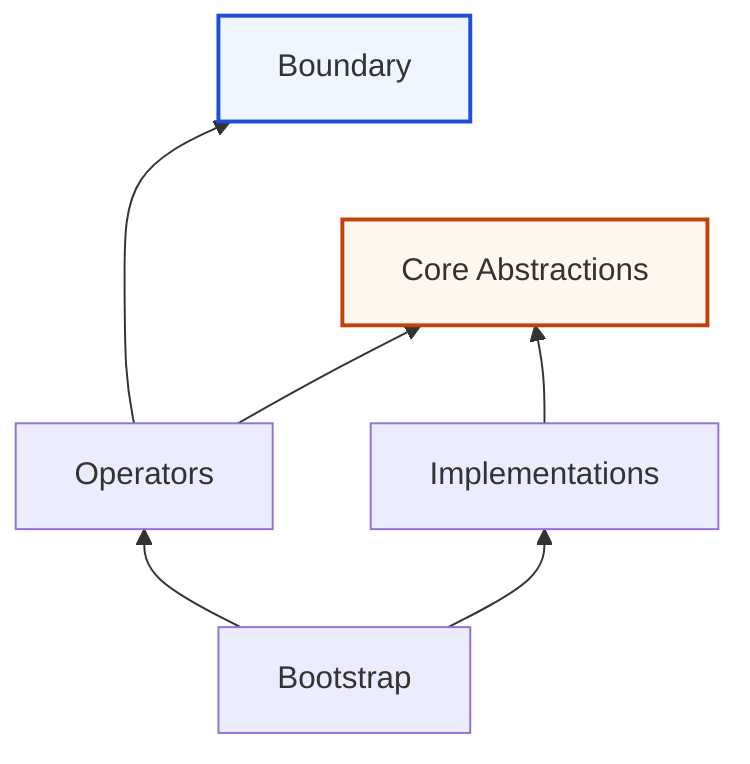

### 4) Events & Data flow

- **Boundary Events**: events at the system edge (in/out) — belong to Boundary.
- **Core Events**: internal events between Operators ↔ Implementations — belong to Core Abstractions.
- Flow rules:
  - Business flows are initiated in Operators.
  - Technology/specialized logic lives in Implementations; may emit Core Events for Operators.
  - DTO ↔ Entity mapping occurs in Operators.

Processing flow illustration:

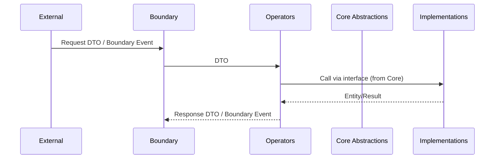

### 5) Dependency Inversion (DIP) in A.D.D

- Interfaces are declared in Core Abstractions.
- Implementations implement those interfaces.
- Operators depend on interfaces, unaware of concrete classes.

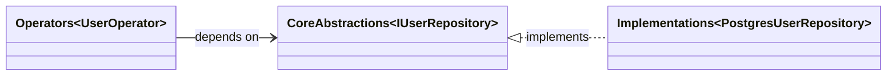

### 6) Anti‑corruption Layer (ACL)

- Placed in Implementations. Outbound/inbound interfaces are described in Core Abstractions.
- Inbound: adapter receives external protocol/payload, translates into clean DTO/Core Events for Operators.
- Outbound: adapter/translator calls 3rd‑party via interface (e.g., `IPaymentGateway`).

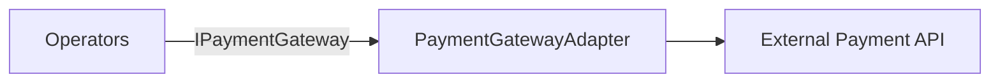

Inbound webhook/queue example:

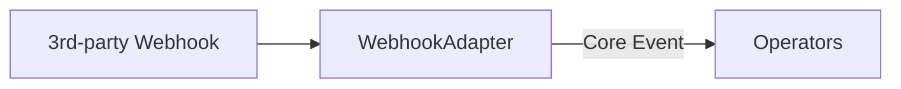

### 7) Evolvable Structure

- Statement: as long as `Operators` (business flows) stay unchanged, you can upgrade/swap technology routinely by replacing `Implementations` and DI configuration in `Bootstrap`.
- How to achieve: clearly separate Abstraction (`Core Abstractions`) and Implementation (`Implementations`); `Operators` depend only on interfaces in `Core Abstractions`; `Bootstrap` selects the concrete variant (Postgres/Mongo/Mock, Rabbit/Kafka/Memory...).
- Practical consequences:
  - Upgrading DB/MQ/SDK or adding new systems touches only `Implementations`/`Bootstrap`, not `Operators`/`Core Abstractions`.
  - Tests remain stable: integration tests for `Operators` stay green if abstraction contracts remain intact.
  - Small change scope, easy rollback, allows side‑by‑side deployment of multiple variants for safe migration.
- Internal module idea: inside each technical module within `Implementations` (Database, Messaging, Payments…), apply a scaled‑down structure: Boundary' (if needed), Core' (internal abstractions), Operators' (internal orchestration), Providers' (concrete technical implementations). Everything is encapsulated within the main system’s `Implementations`.

Illustration of swapping Implementations without touching business:

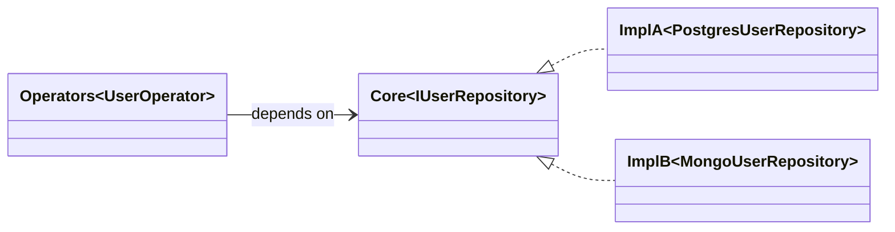

#### 7.1 Example: Database Module (inside Implementations)

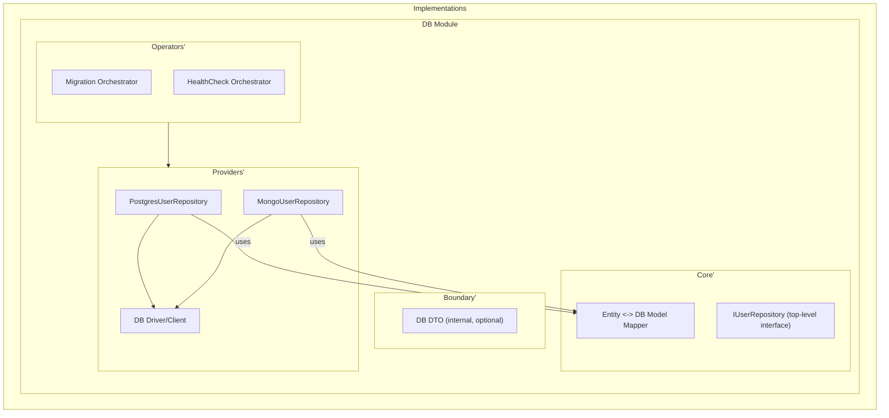

Wiring with the main system (only expose the adapter that implements the top‑level interface):

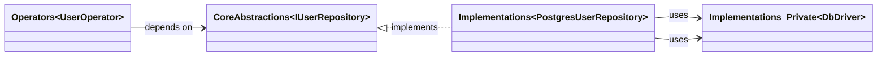

Notes:
- `IUserRepository` belongs to system‑level `Core Abstractions`, not inside the DB module.
- `PostgresUserRepository` is the only adapter exported via DI; the rest (driver, mapper) are internal details of the DB module.

#### 7.2 Example: Messaging (internal Publisher/Consumer)

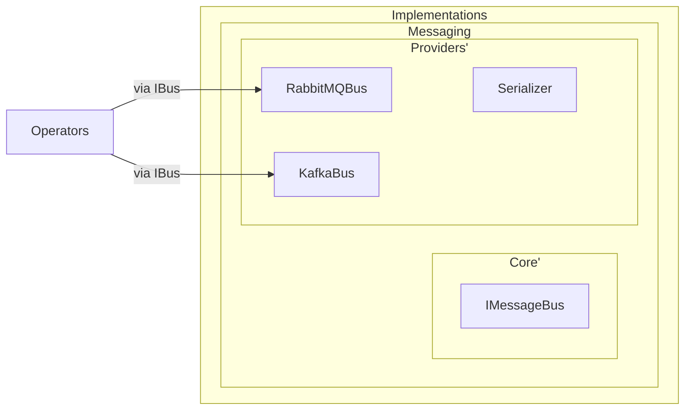

Event consumption flow (Consumer) with Core Events:

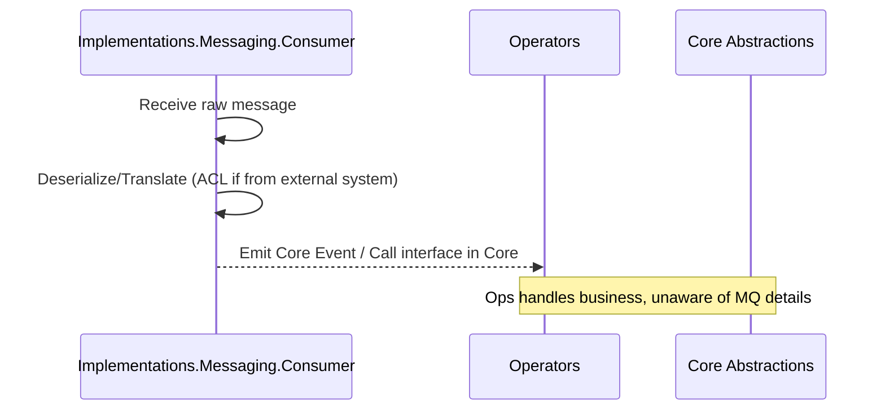

#### 7.3 Example: 3rd‑party Integration (internal ACL module)

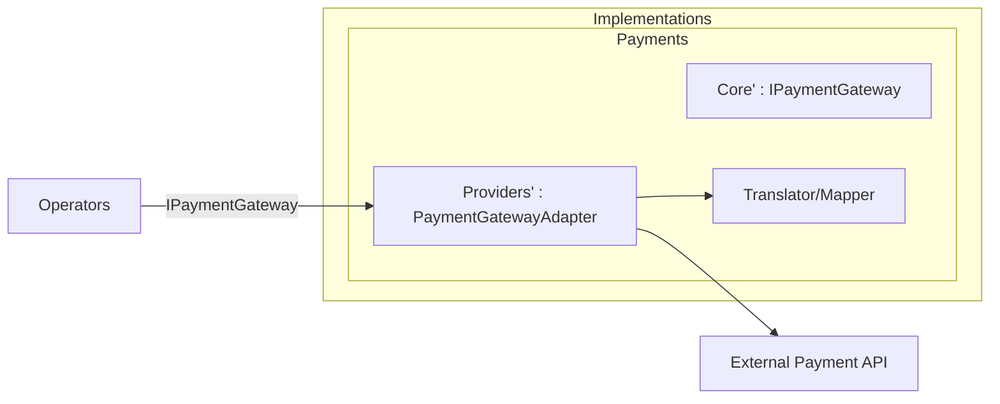

#### 7.4 Packaging & exposure rules
- Only export adapters that implement top‑level interfaces defined in `Core Abstractions` (e.g., `IUserRepository`, `IMessageBus`, `IPaymentGateway`).
- All internal module details (drivers, mappers, operators') are private to `Implementations`.
- `Bootstrap` chooses the variant (Postgres/Mongo/Mock), wiring via DI without code changes in `Operators`.

#### 7.5 Suggested folder structure (illustration)

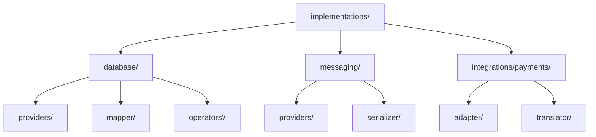

Naming principle: keep roles clear (providers, adapter, mapper, serializer, operators'), avoid confusion with system‑level `Operators`.

### 8) Testing

- **Unit tests**: for Implementations (adapters, mappers, repositories) and Entity validation.
- **Integration tests**: for Operators following business flows (coordinated via interfaces/events).

### 9) Deployment strategy

#### Large projects (from BRD)
1) Build Boundary: real DTOs, service contracts, Boundary Events.
2) Build Core Abstractions: Entities, Core Events, internal interfaces.
3) Build Operators: implement business logic, mapping DTO ↔ Entity, listeners for Boundary Events, endpoints.
4) Build Implementations: implement interfaces, adapters/publishers/subscribers, ACL when integrating external systems.
5) Bootstrap/DI: configure everything.

#### Small projects (from zero)
1) Write a runnable program (minimal monolith).
2) Write unit tests.
3) Refactor to split layers following V3.

#### Existing projects
1) Classify using the question: abstract (Boundary/Core Abstractions) or concrete (Operators/Implementations)?
2) Move to the corresponding layer; replace direct calls with interfaces/events where necessary.

### 10) Practice conventions

- Entities: contain no behavior beyond validation; avoid heavy business logic.
- Operators: name by flow (e.g., `OrderOperator`, `InvoiceOperator`), orchestrate and map.
- Interfaces: placed in Core Abstractions; Implementations implement them; Boundary only publishes external contracts when needed.
- Events: name states clearly before/after, payload is DTO/Entity appropriate to the consuming layer.

### 11) Summary

A.D.D V3 standardizes layers: Boundary / Core Abstractions / Operators / Implementations / Bootstrap, with DIP as the core principle, explicit data flow and events. This structure makes implementation, testing, and technology replacement easier without affecting business logic.


### 12) A.D.D‑Extended — for complex domains

- **Goal**: Keep the A.D.D skeleton, add guardrails to handle complex rules.

#### 12.1 Modularization by “Scope Module”
- Split system into modules with clear scope (Scope Module), each self‑contained: `Boundary/Core Abstractions/Operators/Implementations/Bootstrap`.
- Cross‑module communication only via interfaces published in `Core Abstractions` and via Core Events. Direct cross access is forbidden.

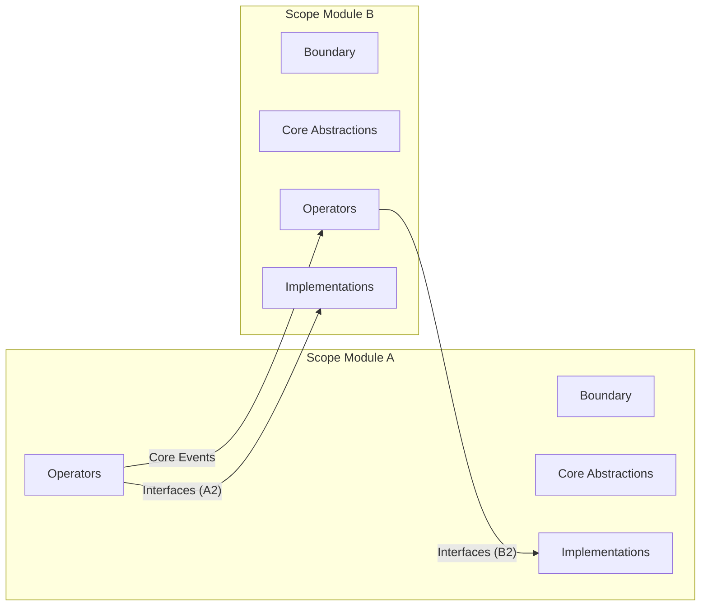

#### 12.2 RuleSet & Checkpoint (pure, testable rules)
- Declare `RuleSet` in `Core Abstractions` as pure functions that validate state and inputs.
- `Checkpoint` is a combinator to compose multiple `RuleSet` into a pipeline. `Operators` run `Checkpoint` before persisting changes.
- Result returns a `RuleReport` (pass/fail, reasons, location), no exceptions for the normal flow.

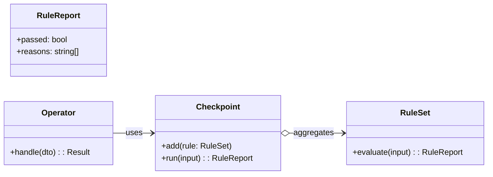

#### 12.3 Transaction Group Operator (TGO)
- Define `TGO` (a kind of `Operator`) as the transaction boundary for a related data group.
- Repositories published by `Core Abstractions` only allow operations through the group’s “root” to ensure integrity.
- `TGO` decides commit/rollback, hides the transaction driver details in `Implementations`.

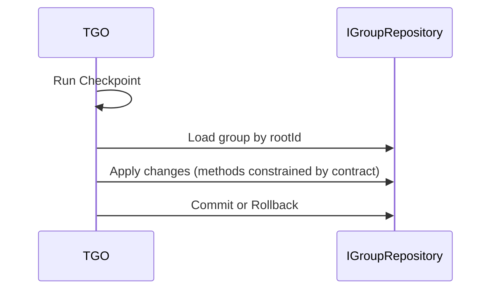

#### 12.4 Signal types: BusinessSignal vs TechnicalSignal
- Still use `Core Events`, but tag them:
  - `BusinessSignal`: reflects business state (stable over time, versioned).
  - `TechnicalSignal`: technical signals (retry, telemetry, housekeeping).
- Idempotency, versioning and outbox mapping are placed in `Implementations` (ACL), no infrastructure details leak.

#### 12.5 Interaction Map (non‑invasive cross‑module translation)
- Put translators in a module’s `Core Abstractions` as clear contracts to convert DTOs between modules.
- Adapters implement translators and invoke infrastructure in `Implementations` (ACL), keeping `Operators` clean.

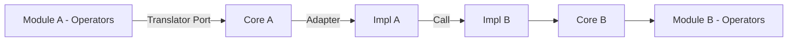

#### 12.6 Consistency modes
- `consistency = strong | eventual` declared in `Operators` per use‑case.
- Strong: runs within a single `TGO`.
- Eventual: coordinated by a `Coordinator Operator` using `Core Events`, with a `Compensator` (pure function describing inverse action) declared in `Core Abstractions`.

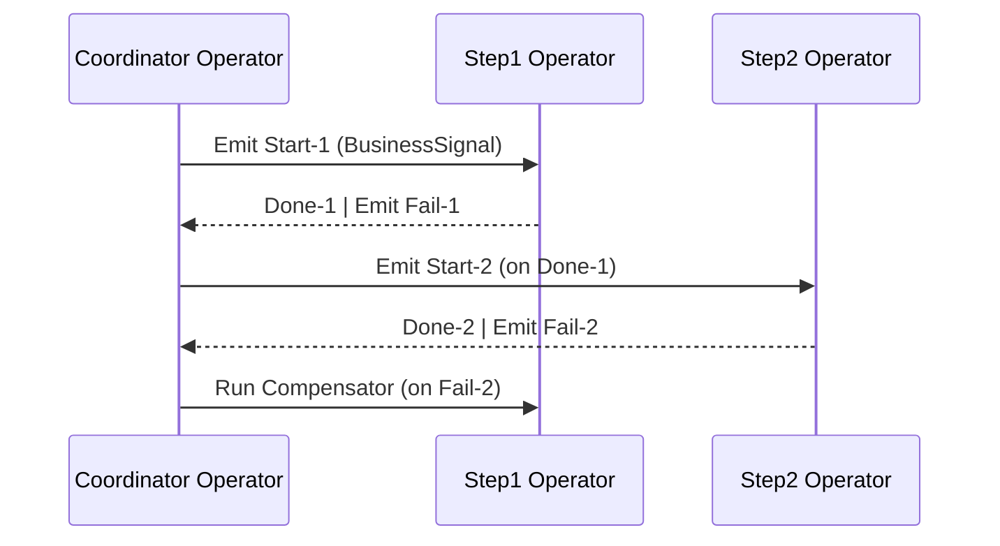

#### 12.7 Shared Terms (deployment‑level ubiquitous language)
- Each Scope Module has `shared-terms.md` describing vocabulary and sample data.
- CI checks naming drift between docs and source code (type/DTO/interface names).

#### 12.8 Contracts & testing
- `RuleSet` tests (pure functions) in `Core Abstractions`.
- `Operator` flow tests per `Checkpoint` and consistency mode.
- Adapter conformance tests for `Implementations` based on translator and repository contracts.

#### 12.9 Architectural guardrails
- Lint dependency rules: `Operators` only see `Boundary` and `Core Abstractions`; `Implementations` only see `Core Abstractions`.
- DI wires only through published interfaces; wiring across another module’s internals is forbidden.

#### 12.10 Suggested directory skeleton (per Scope Module)

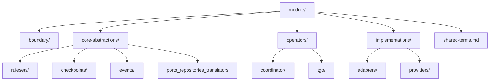

#### 12.11 Summary of new concepts by layer

- Boundary
  - Use‑case contracts (DTO, Boundary Events) — stable, clearly emphasize input/output.

- Core Abstractions
  - RuleSet: pure function for rule checks, returns `RuleReport`.
  - Checkpoint: combine multiple RuleSet into a pipeline.
  - RuleReport: pass/fail result, reasons.
  - Core Events with tags: BusinessSignal, TechnicalSignal.
  - Ports: repository, translator (Interaction Map), compensator signature.

- Operators
  - Transaction Group Operator (TGO): transaction boundary for a related data group.
  - Coordinator Operator: orchestrates multi‑step flows via Core Events (eventual consistency).
  - Consistency hint: strong | eventual per use‑case.
  - Execute Checkpoint before persisting changes.

- Implementations
  - Adapters/Providers implement Ports; translators; transaction driver.
  - Outbox mapping, idempotency, versioning for signals.
  - ACL with external systems, serializer, messaging bus provider.

- Bootstrap
  - DI wiring per published Ports; select adapter/provider variants.
  - Enable dependency guardrails (config/lint) to keep boundaries and modules correct.

#### 12.12 Defining Ports

- General notion
  - A Port is an interface published in `Core Abstractions` for other layers to use without knowing technical details.
  - Implementations implement Ports; `Operators` call Ports via DI.
  - Place under `core-abstractions/ports/` of each Scope Module.

- Repository port
  - Purpose: read/write a data group that `TGO` orchestrates, preserving group integrity.
  - Characteristics: operations go through the group’s “root”, commit/rollback controlled by `TGO`.

- Translator port (Interaction Map)
  - Purpose: translate DTOs between two modules, keep semantics stable, avoid leaking internals.
  - Characteristics: pure (no side‑effects), may be bidirectional.

- Compensator signature
  - Purpose: describe inverse actions for steps in eventual consistency flows.
  - Characteristics: pure/independent of infrastructure; result indicates success and reasons.

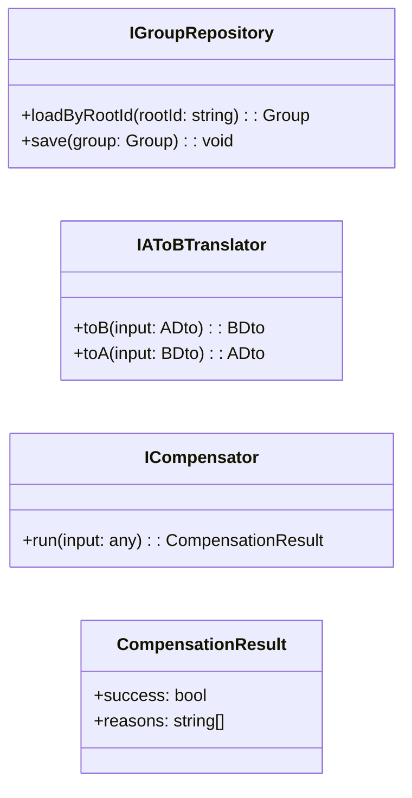

#### 12.13 Glossary (ADD‑Extended)

- Scope Module: A module with clear scope, self‑contained with layers `Boundary/Core Abstractions/Operators/Implementations/Bootstrap`; communicates with others via Ports and Core Events.
- RuleSet: Pure function that checks one or several rules on inputs and current state, returns `RuleReport`.
- Checkpoint: Combines multiple RuleSet into a pipeline; runs before applying changes.
- RuleReport: Rule check result (passed, reasons[]), no exceptions for the normal flow.
- Transaction Group Operator (TGO): Operator serving as the transaction boundary for a related data group; runs Checkpoint, operates repository ports, decides commit/rollback.
- Coordinator Operator: Operator orchestrating multi‑step flows via Core Events for eventual consistency; may trigger a Compensator for rollback.
- BusinessSignal: Core Event reflecting business state with long‑term meaning; versioned for evolutionary compatibility.
- TechnicalSignal: Operational signals (retry, telemetry, housekeeping) without long‑term business semantics.
- Ports: Interfaces published in `Core Abstractions` to be used via DI without knowing technical details.
  - Repository Port: Contract to read/write the data group orchestrated by TGO through the root.
  - Translator Port: Contract to translate DTOs between modules (Interaction Map), pure and semantically stable.
  - Compensator Port: Contract describing inverse actions for eventual consistency flows.
- Interaction Map: Set of translators between two modules, clearly describing translation directions and corresponding DTO structures.
- Consistency (strong | eventual): Consistency hint per use‑case; strong within one TGO; eventual via Coordinator and Core Events.
- Compensator: Executes inverse action when a later step fails in a multi‑step flow; pure, returns success/reasons.
- Outbox mapping: Mechanism mapping internal changes to event records for safe/ordered publishing; implemented in Implementations.
- Idempotency: Ensure repeated processing causes no side‑effects; place recognition and guarding logic in Implementations.
- Versioning (signals/contracts): Version signals/contracts for evolutionary compatibility; decode/encode in Implementations.
- ACL (Anti‑corruption Layer): Protective layer when integrating external systems (webhook, API); translate/normalize payload into clean DTO/Core Events before reaching Operators; isolate mapping, outbox, idempotency/versioning in Implementations.
- Transaction Driver: Technical component executing transactions (DB/client) hidden within Implementations; TGO does not operate the driver directly.
- Guardrails: Set of rules/checks (lint/build/CI) constraining dependencies across layer and module boundaries; DI only wires through published Ports.

#### 12.14 Full example of complex folder structure

```text
app/
├── bootstrap/
│  ├── di/
│  │  ├── container.ts
│  │  └── wiring.ts
│  ├── config/
│  │  └── app.json
│  └── README.md
│
├── modules/
│  ├── orders/                           # Scope Module: Orders
│  │  ├── README.md
│  │  ├── shared-terms.md
│  │  ├── boundary/
│  │  │  ├── dto/
│  │  │  │  ├── create-order.dto.ts
│  │  │  │  └── update-order.dto.ts
│  │  │  └── events/
│  │  │     ├── order-created.event.ts
│  │  │     └── order-updated.event.ts
│  │  ├── core-abstractions/
│  │  │  ├── ports/
│  │  │  │  ├── repositories/
│  │  │  │  │  └── iorder-group.repository.ts
│  │  │  │  ├── translators/
│  │  │  │  │  └── iorders-to-billing.translator.ts
│  │  │  │  └── compensators/
│  │  │  │     └── icancel-order.compensator.ts
│  │  │  ├── rulesets/
│  │  │  │  ├── stock-available.ruleset.ts
│  │  │  │  └── credit-limit.ruleset.ts
│  │  │  ├── checkpoints/
│  │  │  │  └── create-order.checkpoint.ts
│  │  │  └── events/
│  │  │     ├── business/
│  │  │     │  └── order-approved.signal.ts
│  │  │     └── technical/
│  │  │        └── order-retry.signal.ts
│  │  ├── operators/
│  │  │  ├── tgo/
│  │  │  │  ├── create-order.tgo.ts
│  │  │  │  └── update-order.tgo.ts
│  │  │  └── coordinator/
│  │  │     └── submit-order.flow.ts     # eventual consistency
│  │  └── implementations/
│  │     ├── adapters/
│  │     │  ├── repositories/
│  │     │  │  └── order-group.pg.adapter.ts
│  │     │  ├── translators/
│  │     │  │  └── orders-to-billing.default.adapter.ts
│  │     │  └── compensators/
│  │     │     └── cancel-order.default.adapter.ts
│  │     └── providers/
│  │        ├── db/
│  │        │  └── pg/
│  │        │     ├── client.ts
│  │        │     └── transaction-driver.ts
│  │        ├── messaging/
│  │        │  └── rabbit/
│  │        │     └── bus.ts
│  │        └── acl/
│  │           └── billing-api.adapter.ts
│  │
│  └── billing/                        # Scope Module: Billing
│     ├── README.md
│     ├── shared-terms.md
│     ├── boundary/
│     │  └── dto/
│     │     └── create-invoice.dto.ts
│     ├── core-abstractions/
│     │  ├── ports/
│     │  │  └── repositories/
│     │  │     └── iinvoice-group.repository.ts
│     │  ├── rulesets/
│     │  │  └── invoice-total.ruleset.ts
│     │  ├── checkpoints/
│     │  │  └── create-invoice.checkpoint.ts
│     │  └── events/
│     │     └── business/
│     │        └── invoice-issued.signal.ts
│     ├── operators/
│     │  └── tgo/
│     │     └── create-invoice.tgo.ts
│     └── implementations/
│        ├── adapters/
│        │  └── repositories/
│        │     └── invoice-group.pg.adapter.ts
│        └── providers/
│           └── db/
│              └── pg/
│                 ├── client.ts
│                 └── transaction-driver.ts
│
└── shared/
   ├── libraries/
   │  ├── time/
   │  └── ids/
   ├── messaging/
   │  └── outbox/
   │     ├── store.ts
   │     └── publisher.ts
   └── guards/
      └── architecture.lint.json
```


#### 12.15 Replacing DDD in implementation

- Scope of replacement
  - A.D.D‑Extended can replace DDD at the implementation (tactical) layer and most operational strategy aspects: module boundaries, events, contracts, transactions, integrations.
  - Keep organization‑level strategic thinking (proper module scoping, ubiquitous language) via `Scope Module`, `shared-terms.md`, and dependency guardrails.

- Key principles
  - DIP‑first: Interfaces/Ports live in `Core Abstractions`; DI only wires through published Ports.
  - Orchestration in `Operators`: use `TGO` (strong/transactional) or `Coordinator` (eventual consistency) with a `Compensator`.
  - Pure rules: model invariants using `RuleSet` + `Checkpoint` returning a `RuleReport` (no exceptions for the normal flow).
  - Clear events: `Core Events` tagged `BusinessSignal`/`TechnicalSignal`, versioned; outbox/idempotency/codec reside in `Implementations`.
  - Anti‑corruption: external integrations via ACL in `Implementations`; translators are Ports.

- Quick mapping DDD → A.D.D‑Extended
  - Bounded Context → `Scope Module` + dependency guardrails + DI through Ports.
  - Context Map/Anti‑corruption → `Interaction Map` (translator ports) + ACL adapters.
  - Aggregate invariants → `RuleSet` + `Checkpoint`; group transaction → `TGO` + repository port “via root”.
  - Process Manager/Saga → `Coordinator Operator` + `consistency = strong | eventual` + `Compensator`.
  - Domain Events → `Core Events` (Business/Technical) + versioning + outbox.

- DDD → A.D.D migration checklist (concise)
  1) Finalize `Scope Modules` following existing Bounded Context boundaries.
  2) Extract `Ports` (repositories/translators/compensators) into each module’s `Core Abstractions`.
  3) Move business orchestration into `Operators` (choose `TGO` or `Coordinator`).
  4) Represent invariants with `RuleSet` + `Checkpoint`; make Entities thinner (validation‑centric).
  5) Move infrastructure into `Implementations` (ACL, outbox, idempotency, versioning, providers).
  6) Enable guardrails (dependency lint, DI rules) and add conformance tests for adapters/providers.

- Decision criteria
  - Heavy integrations/frequent tech swaps, automation/AI prioritized → use A.D.D as the primary implementation skeleton.
  - Domains with complex rules → keep ubiquitous language via `shared-terms.md` and model rules with `RuleSet/Checkpoint`.
  - Release safety → rely on outbox, idempotency, versioning in `Implementations`; keep `Operators` stable by contract.
